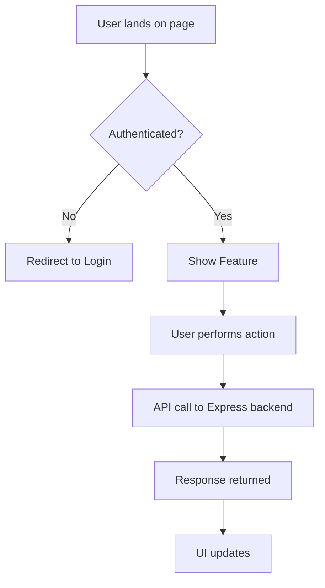

> **Lane check:** This command applies to **spec lane** and **decision lane** tasks only. Fast-lane tasks skip `/spec` and proceed directly to `/implement`.

Based on the clarified task, create a spec document and save it to `docs/specs/<YYYY-MM-DD>-SPEC-<task-slug>.md`.

Use this format exactly. Fill in every section — if a section does not apply, write "N/A" with a one-line reason rather than deleting it. Leave the **Open Questions** section populated with any remaining ambiguity or assumption that still needs owner confirmation.

---

# Feature: [Name]

**Status:** Draft | In Review | Approved
**Owner:** [Author]
**Last Updated:** YYYY-MM-DD

---

## Goal

One sentence: what does this feature achieve and why does it matter?

## Stakeholders

- **Requestor:**
- **Users affected:**
- **Teams involved:** Backend, Frontend

---

## User Stories

### Story 1: [Short Title]

**As a** [type of user],
**I want to** [perform an action],
**So that** [I achieve a benefit].

#### Acceptance Criteria

- **Given** [initial context], **When** [user action], **Then** [expected outcome]
- **Given** [initial context], **When** [user action], **Then** [expected outcome]

---

## Data Requirements

| Field | Type | Required | Constraints | Notes |
| ----- | ---- | -------- | ----------- | ----- |
|       |      |          |             |       |

---

## Flow Diagram

---

## API Contract (for @backend-dev)

| Method | Endpoint             | Auth | Description     |
| ------ | -------------------- | ---- | --------------- |
| GET    | /api/v1/resource     | ✅   | List resources  |
| POST   | /api/v1/resource     | ✅   | Create resource |
| PUT    | /api/v1/resource/:id | ✅   | Update resource |
| DELETE | /api/v1/resource/:id | ✅   | Delete resource |

---

## Edge Cases

- What happens if the user submits the form twice quickly?
- What happens if the network request fails?
- What if the resource belongs to a different user?

---

## Out of Scope

- Explicitly list what will NOT be built in this version

---

## Open Questions

❓ [Question] — Owner: [Name] — Due: [Date]

---

## Dependencies

- **Depends on:** [feature or service that must exist first]
- **Blocks:** [feature or service waiting on this]

---

After saving, output exactly: `Spec saved to docs/specs/SPEC-<slug>.md. Please review and reply 'approved' to proceed.`

Do NOT write any logs or code yet.
