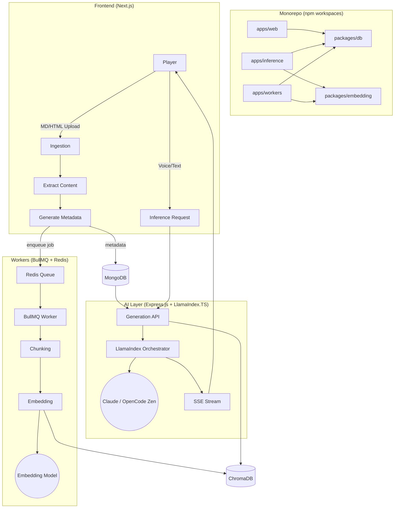

# 🏗️ SecondSeat - Software Design Document

This document defines the technical architecture, data structures, and implementation standards for SecondSeat.

---

## 1. Tech Stack

**The "How":** High-level technical architecture and tooling.

| Layer                            | Technology                                                     | Notes                                                                                                                                                                                                                                                                                             |
| :------------------------------- | :------------------------------------------------------------- | :------------------------------------------------------------------------------------------------------------------------------------------------------------------------------------------------------------------------------------------------------------------------------------------------ |
| **Repository Structure**         | npm workspaces monorepo                                        | Root `package.json` manages `apps/*` and `packages/*` workspaces so the web app, inference service, workers, and shared libraries can be developed and versioned together.                                                                                                                        |
| **Frontend & Ingestion Gateway** | Next.js (App Router), TypeScript, Tailwind CSS                 | Serves as both the user-facing UI and the backend entry point for ingestion. Handles file uploads (MD, HTML), content extraction, and metadata generation before dispatching BullMQ jobs.                                                                                                         |
| **Ingestion Workers**            | BullMQ + Redis                                                 | Node.js job queue for heavy async processing: document chunking and embedding generation. Decoupled from Next.js to keep the main app non-blocking. Redis is the backing store for the queue.                                                                                                     |
| **AI / Inference Layer**         | Express.js (TypeScript)                                        | Dedicated Node.js backend for inference. Exposes the Generation API, orchestrates RAG retrieval, enforces spoiler-safety policy, and streams responses via SSE.                                                                                                                                   |
| **Shared Libraries**             | Workspace packages (`@secondseat/db`, `@secondseat/embedding`) | Shared packages centralize reusable Mongo/Mongoose access and embedding model logic so all apps stay aligned on database and vector behavior.                                                                                                                                                     |
| **RAG Orchestration**            | LlamaIndex.TS                                                  | Used within the inference service (and workers for chunking) to wire loaders, node parsers, retrievers, and chat engines. Replaces the earlier LangChain.js choice — better fit because the product is RAG-centric.                                                                               |
| **Schema Validation**            | Zod                                                            | Runtime request/response validation across the inference API.                                                                                                                                                                                                                                     |
| **Database**                     | MongoDB (Metadata), ChromaDB (Vector Embeddings)               | MongoDB for guides, users, session memory, and document metadata. ChromaDB for vectorized content chunks via the `chromadb` npm client.                                                                                                                                                           |
| **ODM**                          | Mongoose                                                       | Shared via the `@secondseat/db` package and consumed by the app workspaces.                                                                                                                                                                                                                       |
| **LLM (Generation)**             | Anthropic Claude (production) / OpenCode Zen (development)     | Production calls go to the Anthropic SDK directly (`@anthropic-ai/sdk`). Development / testing uses OpenCode Zen via its OpenAI-compatible HTTP surface (LlamaIndex's `OpenAI` provider with a custom `baseURL`). Both sit behind a single `LlmAdapter` interface so swapping is a config change. |
| **Embeddings**                   | `all-MiniLM-L6-v2` via `@xenova/transformers`                  | In-process embedding model, 384-dim output. Shared via `@secondseat/embedding`. **Same model in both ingestion (workers) and inference (Express)** — vector-space parity is a hard constraint.                                                                                                    |
| **Voice (STT)**                  | Web Speech API (browser)                                       | Player voice input + "Hey SS" wake phrase via the browser-native Web Speech API. Chromium-first; graceful text fallback elsewhere.                                                                                                                                                                |
| **Voice (TTS)**                  | Pocket TTS (`kyutai-labs/pocket-tts`)                          | Optional hint readout. Runs as a sidecar service (Python/Rust) that Express calls — no first-class Node.js bindings.                                                                                                                                                                              |
| **Streaming**                    | Server-Sent Events (SSE)                                       | Used by the Express inference service to stream LLM responses back to the Next.js frontend in real time.                                                                                                                                                                                          |
| **Infrastructure**               | MongoDB + Redis + ChromaDB (Docker Compose)                    | Local infrastructure is defined in the root `docker-compose.yml`. LLM is hosted (Anthropic / OpenCode Zen), so no local model server is required in the default config.                                                                                                                           |

---

## 2. System Architecture

SecondSeat uses a unified TypeScript/Node.js stack organized as an npm workspaces monorepo. The main deployable surfaces live under `apps/`, shared libraries live under `packages/`, and local infrastructure is started from the repository root with Docker Compose.

- **Monorepo Layer (npm workspaces):** The root workspace manages application packages (`apps/web`, `apps/inference`, `apps/workers`) plus shared libraries (`packages/db`, `packages/embedding`) so common code can be reused without publishing separate packages.
- **Frontend & Ingestion Layer (Next.js):** Serves the player-facing UI (game selection, voice/text input, hint display) and handles document ingestion. Uploads (MD, HTML) are processed to extract content, generate metadata stored in MongoDB, and enqueue BullMQ jobs for heavy work.
- **Processing Layer (BullMQ + Redis):** Node.js workers consume jobs from the BullMQ queue to chunk documents and generate embeddings. Decoupled from Next.js to keep the main app non-blocking. Redis backs the queue.
- **AI / Inference Layer (Express.js):** Dedicated Node.js service that receives player queries, assembles prompts with LlamaIndex.TS (game context + session memory + retrieved guide chunks), calls the Anthropic Claude API (or OpenCode Zen in development), enforces spoiler-safety policy, and streams the response back via SSE.
- **Shared Package Layer:** `@secondseat/db` encapsulates reusable Mongoose/database wiring, while `@secondseat/embedding` holds the shared embedding model integration used by workers and inference.
- **Storage Layer:** MongoDB for structured metadata (guides, users, session memory, document info) and ChromaDB for vectorized guide content chunks.

**The Logic:** Visualizing how components interact.



---

## 3. Database Design

**The Data:** MongoDB collection schemas for SecondSeat.

- refer to [Data Model](data_model.md)

---

## 4. API Documentation

**The Interface:** Core endpoints and their functionality.

### Next.js API Routes (Ingestion Gateway)

| Method | Endpoint                    | Description                                                                       | Auth Required |
| :----- | :-------------------------- | :-------------------------------------------------------------------------------- | :------------ |
| `POST` | `/api/auth/login`           | User authentication and session management                                        | No            |
| `POST` | `/api/ingest`               | Upload document (MD/HTML), extract content, generate metadata, dispatch to BullMQ | Yes           |
| `GET`  | `/api/ingest/status/:jobId` | Check ingestion job status                                                        | Yes           |

### Express.js Endpoints (Inference Layer)

| Method   | Endpoint                     | Description                                                         | Auth Required |
| :------- | :--------------------------- | :------------------------------------------------------------------ | :------------ |
| `POST`   | `/api/v1/generate`           | Submit query for AI-generated guidance; returns hint via SSE stream | Yes           |
| `GET`    | `/api/v1/stream/:sessionId`  | SSE endpoint for real-time streaming responses                      | Yes           |
| `GET`    | `/api/v1/session/:sessionId` | Retrieve lightweight session memory for a player session            | Yes           |
| `DELETE` | `/api/v1/session/:sessionId` | Clear session memory                                                | Yes           |
| `GET`    | `/api/v1/health`             | Health check for inference service                                  | No            |

---

## 5. UI/UX Design

**The Visuals:** Links to visual documentation and wireframes.

- **Figma Link:** [SecondSeat Design](https://www.metacritic.com/game/resident-evil-requiem/)
- **Design Principles:**
  - **Flow-Preserving:** Minimal interaction required.
  - **Non-Invasive:** Transparent overlays for OBS/Streamers.
  - **Dark Mode Default:** Optimized for gaming environments.
- **Key Components**:
  - Push-to-Talk HUD
  - Hint Overlay (High Contrast)
  - Ingestion Dashboard

---

## 6. Implementation Layer

**The Standards:** Naming conventions and project structure.

### 🏷️ Naming Conventions

- **Files**: `kebab-case.ts`
- **Classes**: `PascalCase`
- **Functions/Variables**: `camelCase` (JS)
- **Constants**: `UPPER_SNAKE_CASE`

### 📂 Folder Structure

```bash
/package.json           # Root workspace manifest and shared scripts
/docker-compose.yml     # Local MongoDB, Redis, and ChromaDB services
/tsconfig.base.json     # Shared TypeScript base configuration

/apps/web               # Next.js application (frontend + ingestion gateway)
  /src
    /app                # App Router pages, layouts, and route handlers
    /components         # React UI components
    /lib                # Utilities, session/auth helpers, infrastructure clients
    /models             # Web app domain models
  /scripts              # Workspace-specific scripts

/apps/inference         # Express.js inference service (TypeScript)
  /src
    /config             # Environment and runtime config
    /lib                # Shared service internals and utilities
    /middleware         # Auth, security, error handling, SSE setup
    /routes             # HTTP route handlers
    /schemas            # Zod request/response schemas
    /services           # RAG orchestration, LLM adapters, session logic
    /types              # Inference-specific types

/apps/workers           # BullMQ workers (TypeScript)
  /src
    /config             # BullMQ and Redis configuration
    /db.ts              # Worker database wiring
    /health.ts          # Worker health helpers
    /lib                # Worker utilities
    /models             # Worker-side models/types
    /processors         # Chunking and embedding processor functions
    /queues             # Queue definitions and job type declarations
    /services           # Ingestion pipeline services

/packages/db            # Shared Mongoose/database package
  /src
    /models             # Shared database models

/packages/embedding     # Shared embedding package
  /src                  # Embedding model and related helpers

/docs                   # Product, architecture, and delivery documentation
```

---

## 7. Authentication & Security

- **Auth Provider**: Next.js handles authentication via session-based auth or JWT. The Express inference service validates tokens on each inference request.
- **Data Protection**: Raw audio is never persisted — transcription only, discarded after the hint response is returned. LLM queries go to the Anthropic API; no session data is retained by the provider beyond the request.
- **Privacy**: Push-to-talk (Web Speech API) ensures active recording only when triggered by the player.

---

## 8. Data Flow Summary

### Ingestion Flow

1. User uploads MD/HTML file via Next.js UI
2. Next.js API extracts content from source
3. Next.js generates metadata and stores in MongoDB
4. Next.js enqueues a BullMQ job (via Redis)
5. BullMQ worker picks up the job and chunks the document
6. BullMQ worker generates embeddings via the Embedding Model
7. Embeddings stored in ChromaDB (VectorDB)

### Inference Flow

1. Player submits voice or text query via Next.js UI
2. Next.js forwards request to Express.js Generation API
3. Express retrieves relevant guide chunks from ChromaDB and session memory from MongoDB
4. LlamaIndex.TS assembles the prompt (game context + retrieved chunks + spoiler-safety policy)
5. Anthropic Claude (production) or OpenCode Zen (development) generates a 1–3 line hint
6. Response streamed back to Next.js via SSE and displayed to the player
7. _(Optional)_ Pocket TTS sidecar converts the hint to speech for readout
