# Feature: Guide Writer UI Polish & Source Delete Pipeline

**Status:** Approved
**Owner:** rjasino-fs
**Last Updated:** 2026-05-26

---

## Goal

Improve the guide writer editor experience with a fixed formatting toolbar, a visible autosave indicator, and a safe draft-delete flow; and replace the existing instant source-record wipe with an async soft-delete pipeline that cleanly removes vector data from ChromaDB before destroying the MongoDB records.

## Stakeholders

- **Requestor:** rjasino-fs
- **Users affected:** Admin users writing and managing ingestion sources via the dashboard.
- **Teams involved:** Frontend (Next.js), Backend (API routes), Workers (BullMQ)

---

## User Stories

### Story 1: Fixed Formatting Toolbar

**As an** admin writing a guide,
**I want to** see formatting controls in a permanent toolbar above the editor at all times,
**So that** I can apply formatting without having to select text first to reveal a bubble menu.

#### Acceptance Criteria

- **Given** the guide writer page is loaded, **When** the editor mounts, **Then** a static toolbar is visible at the top of the editor card with all formatting buttons (Bold, Italic, Underline, Strike, Inline Code, H1, H2, H3, Bullet List, Ordered List, Blockquote, Code Block, Superscript, Subscript) grouped by dividers.
- **Given** the toolbar is visible, **When** a formatting button is clicked, **Then** the editor retains focus and the format is applied without the editor losing its caret position.
- **Given** a formatting mark is active at the cursor, **When** the toolbar renders, **Then** the corresponding button is shown in its active state (accent border + tinted background).
- **Given** the page is loaded, **When** no text is selected and no bubble menu interaction occurs, **Then** no BubbleMenu component is rendered in the DOM.

---

### Story 2: Autosave Indicator

**As an** admin writing a guide,
**I want to** see exactly when my last autosave completed,
**So that** I have confidence my work is not lost.

#### Acceptance Criteria

- **Given** the editor has unsaved changes and 10 seconds have elapsed, **When** the autosave API call completes successfully, **Then** a label below the editor reads "Autosaved at HH:MM AM/PM" using the local time of the save completion.
- **Given** an autosave has never completed in this session, **When** the editor is displayed, **Then** no autosave label is shown below the editor.
- **Given** an autosave label is showing, **When** a subsequent autosave completes, **Then** the label updates in place with the new time.
- **Given** a save is in progress, **When** the save state is "saving", **Then** the header indicator reads "Saving…" (existing behaviour retained).
- **Given** a save has just completed, **When** the save state transitions to "saved", **Then** the header indicator shows "Saved ✓" with a checkmark and remains visible (not ephemeral).
- **Given** a save fails, **When** the save state is "error", **Then** the header indicator shows "Save failed — retrying…" in danger colour (existing behaviour retained).

---

### Story 3: Delete Draft

**As an** admin writing a guide,
**I want to** permanently delete a draft I no longer need, with a confirmation prompt,
**So that** I can keep the source list clean without accidentally losing work.

#### Acceptance Criteria

- **Given** the guide writer has an existing draft (sourceId is set), **When** the page renders, **Then** a "Delete Draft" button is visible in the action row at the bottom.
- **Given** the guide writer has not yet been saved (no sourceId), **When** the page renders, **Then** no "Delete Draft" button is shown.
- **Given** the user clicks "Delete Draft", **When** the ConfirmDialog opens, **Then** it displays a title "Delete draft?", a message "This will permanently delete this draft. This cannot be undone.", a red "Delete" confirm button, and a "Cancel" button.
- **Given** the ConfirmDialog is open, **When** the user clicks "Cancel", **Then** the dialog closes and no API call is made.
- **Given** the ConfirmDialog is open, **When** the user clicks "Delete", **Then** `DELETE /api/ingest/drafts/{sourceId}` is called and on `204` the user is redirected to `/dashboard/ingest`.
- **Given** the delete API returns an error, **When** the response is not `204`, **Then** the dialog closes and an inline error message is shown in the action area.

---

### Story 4: Async Source Delete with Vector Cleanup

**As an** admin managing ingested sources,
**I want to** delete a source and have all its associated vector data, ingestion jobs, and the source record removed cleanly,
**So that** stale knowledge does not pollute future RAG retrievals.

#### Acceptance Criteria

- **Given** a source exists with any non-processing status, **When** the user clicks "Delete" on the source detail page, **Then** a ConfirmDialog opens (same reusable component as Story 3).
- **Given** the ConfirmDialog is confirmed, **When** `DELETE /api/ingest/sources/{sourceId}` is called, **Then** the API sets `source.status = "deleting"`, enqueues a `delete-source` BullMQ job, and responds `202 { jobId }`.
- **Given** the status is already `"deleting"`, **When** `DELETE /api/ingest/sources/{sourceId}` is called again (idempotent), **Then** the API responds `202` without enqueuing a duplicate job.
- **Given** the source status is `"processing"`, **When** `DELETE /api/ingest/sources/{sourceId}` is called, **Then** the API responds `409` and the delete button remains disabled (existing behaviour).
- **Given** a `delete-source` job is running, **When** the source detail page is polling, **Then** the UI shows a "Deleting…" status badge and the Delete button is disabled.
- **Given** the worker successfully deletes all vectors from ChromaDB, **When** the deletion completes, **Then** the worker hard-deletes the `RagSource` document and all associated `RagIngestionJob` documents from MongoDB.
- **Given** ChromaDB has no vectors for this source (e.g. ingestion never completed), **When** the worker runs, **Then** the worker treats this as a no-op and still proceeds to hard-delete the MongoDB records (idempotent vector step).
- **Given** the worker fails (ChromaDB unreachable), **When** BullMQ retries are exhausted, **Then** the worker resets `source.status` to its pre-delete value, logs the error, and the source detail page shows a "Delete failed — please try again" message so the user can manually retry the delete action.

---

### Story 5: Reusable ConfirmDialog Component

**As a** developer,
**I want** a single `ConfirmDialog` component usable across the draft delete and source delete flows,
**So that** confirmation UX is consistent and the pattern is not duplicated.

#### Acceptance Criteria

- **Given** `open={false}`, **When** the component renders, **Then** nothing is mounted in the DOM.
- **Given** `open={true}`, **When** the component renders, **Then** a modal overlay covers the full viewport and the dialog is centered.
- **Given** the dialog is open, **When** the user presses Escape, **Then** `onCancel` is called.
- **Given** the dialog is open, **When** the user clicks the backdrop, **Then** `onCancel` is called.
- Props: `open: boolean`, `title: string`, `message: string`, `confirmLabel: string`, `onConfirm: () => void`, `onCancel: () => void`, `loading?: boolean`.
- **Given** `loading={true}`, **When** the dialog is open, **Then** the confirm button shows a spinner and both buttons are disabled.

---

## Data Requirements

### `RagSource` document — additions

| Field            | Type             | Required | Constraints                      | Notes                                                                                                                                                                           |
| ---------------- | ---------------- | -------- | -------------------------------- | ------------------------------------------------------------------------------------------------------------------------------------------------------------------------------- |
| `status`         | `string`         | ✅       | Extended to include `"deleting"` | Existing field; new value added                                                                                                                                                 |
| `previousStatus` | `string \| null` | —        | Any prior status value           | Written by the API when transitioning to `"deleting"`. Used by the worker to restore status on failure. Cleared (set to `null`) on successful hard-delete (moot at that point). |

### `delete-source` BullMQ job payload

| Field      | Type     | Required | Constraints            | Notes                  |
| ---------- | -------- | -------- | ---------------------- | ---------------------- |
| `sourceId` | `string` | ✅       | Valid MongoDB ObjectId | The source to clean up |

> ChromaDB uses a single shared collection. The worker queries by metadata filter `{ source_id: sourceId }` to find and delete all associated vectors.

### New API response shapes

| Endpoint                               | Success body            |
| -------------------------------------- | ----------------------- |
| `DELETE /api/ingest/drafts/:sourceId`  | `204 No Content`        |
| `DELETE /api/ingest/sources/:sourceId` | `202 { jobId: string }` |

---

## Flow Diagram

```mermaid
flowchart TD
    subgraph GuideWriter ["Guide Writer — Draft Delete"]
        A[User clicks Delete Draft] --> B[ConfirmDialog opens]
        B -->|Cancel| C[Dialog closes — no-op]
        B -->|Confirm| D[DELETE /api/ingest/drafts/:sourceId]
        D -->|204| E[Redirect to /dashboard/ingest]
        D -->|Error| F[Show inline error]
    end

    subgraph SourceDetail ["Source Detail — Source Delete"]
        G[User clicks Delete] --> H[ConfirmDialog opens]
        H -->|Cancel| I[Dialog closes — no-op]
        H -->|Confirm| J[DELETE /api/ingest/sources/:sourceId]
        J -->|Already deleting| K[202 — idempotent no-op]
        J -->|409 processing| L[Show error — cannot delete]
        J -->|202 accepted| M[Set status=deleting, enqueue delete-source job]
        M --> N[UI polls — shows Deleting… badge]
        N --> O{Worker: delete-source job}
        O --> P[Delete vectors from ChromaDB]
        P -->|No vectors found| Q[No-op — continue]
        P -->|Vectors deleted| Q
        Q --> R[Hard-delete RagSource + RagIngestionJobs from MongoDB]
        R --> S[Redirect to /dashboard/ingest]
        O -->|Worker fails after retries| T[Reset status to pre-delete value — show Delete failed message]
    end
```

---

## API Contract

| Method | Endpoint                        | Auth     | Description                                                                                                                                                                         |
| ------ | ------------------------------- | -------- | ----------------------------------------------------------------------------------------------------------------------------------------------------------------------------------- |
| DELETE | `/api/ingest/drafts/:sourceId`  | ✅ admin | Hard-delete a draft source (status must be `"draft"`). Returns `204`.                                                                                                               |
| DELETE | `/api/ingest/sources/:sourceId` | ✅ admin | Soft-delete an ingested source: sets `status="deleting"`, enqueues worker job. Returns `202 { jobId }`. Idempotent if already `"deleting"`. Returns `409` if `status="processing"`. |

### `DELETE /api/ingest/drafts/:sourceId` — response codes

| Code  | Condition                                 |
| ----- | ----------------------------------------- |
| `204` | Draft deleted successfully                |
| `401` | Not authenticated                         |
| `403` | Not admin                                 |
| `404` | Source not found                          |
| `409` | Source exists but status is not `"draft"` |

### `DELETE /api/ingest/sources/:sourceId` — response codes

| Code  | Condition                                                     |
| ----- | ------------------------------------------------------------- |
| `202` | Accepted — delete pipeline initiated (or already in progress) |
| `401` | Not authenticated                                             |
| `403` | Not admin                                                     |
| `404` | Source not found                                              |
| `409` | Source is currently `"processing"` — cannot delete            |

---

## Edge Cases

- **Double-click confirm:** `ConfirmDialog` exposes a `loading` prop; the calling component sets it to `true` after the first confirm click and disables both buttons to prevent duplicate API calls.
- **Draft with no sourceId clicked Delete:** The button is not rendered when `sourceId` is null — impossible via normal UI flow.
- **ChromaDB collection missing:** Worker treats a missing collection as an empty vector set (no-op), proceeds to MongoDB hard-delete.
- **Partial vector deletion (ChromaDB write interrupted):** Worker job re-runs on retry; ChromaDB delete-by-metadata is idempotent — re-deleting already-removed vectors is a no-op.
- **User navigates away during "deleting":** Source stays in `"deleting"` until the worker completes; the source list in `/dashboard/ingest` should show the "deleting" badge.
- **New draft autosaved, then deleted immediately:** `DELETE /api/ingest/drafts/:sourceId` hard-deletes; page shows the "deleted" fallback state already defined in `GuideWriterClient` (`saveState === "deleted"`).
- **Source detail page polled after hard-delete completes:** The `GET /api/ingest/sources/:sourceId` will return `404`; the page should redirect to `/dashboard/ingest` on `404` during polling.
- **"deleting" badge colour:** Uses a dedicated `badge--deleting` CSS class styled amber (`#d97706` text, `rgba(217,119,6,0.15)` background) — distinct from green (completed), blue (processing), and red (failed), signalling a destructive in-progress state.

---

## Out of Scope

- Retry UI for failed source deletes on the source detail page — will be a separate task.
- Deleting vectors for **file-upload** sources (different pipeline, different source type) — separate task.
- Cross-session undo / soft-undelete — permanently out of scope per product constraints.
- Bulk delete of multiple sources — separate task.
- Cleaning up orphaned ChromaDB vectors not associated with any source record — separate maintenance task.

---

## Open Questions

_All open questions resolved — no remaining ambiguity._

| Question                            | Resolution                                                                                                  |
| ----------------------------------- | ----------------------------------------------------------------------------------------------------------- |
| ChromaDB collection name per source | Single shared collection; worker filters by `{ source_id: sourceId }` metadata.                             |
| "deleting" badge colour             | Amber (`#d97706`) with a dedicated `badge--deleting` CSS class — distinct from all existing status colours. |
| Delete failed recovery              | Worker resets status to pre-delete value; user retries the delete manually from the source detail page.     |

---

## Dependencies

- **Depends on:** Existing BullMQ worker infrastructure (`apps/workers`) and ChromaDB client already wired in the ingestion pipeline (Epic I-C).
- **Depends on:** `RagSourceModel` and `RagIngestionJobModel` Mongoose models already defined.
- **Blocks:** Any future RAG retrieval work that assumes vector data is always consistent with source records — this pipeline is the cleanup contract.
