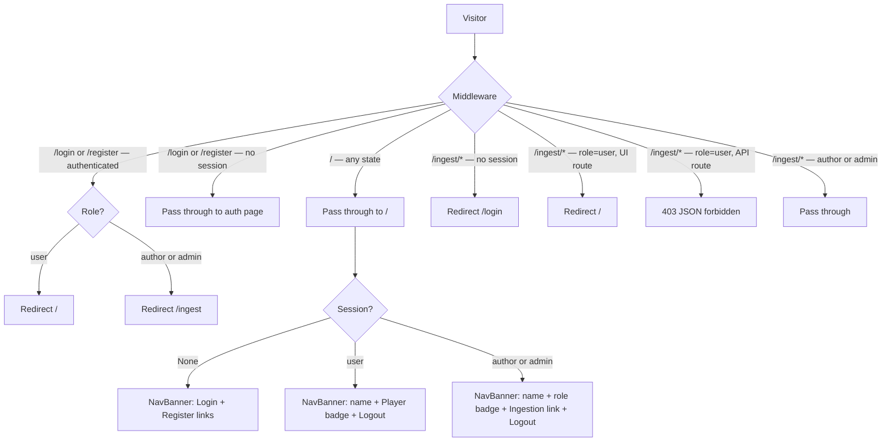

# Feature: Auth Module — Alignment to Spec 2 Contract

**Status:** Approved
**Owner:** rjasino-fs
**Last Updated:** 2026-05-26

---

## Goal

Reconcile the existing auth implementation with the approved Spec 2 contract (`2026-05-26-SPEC-auth-module-2.md`) by tightening API response shapes, slimming the session payload, adding the missing `/api/auth/me` endpoint, changing logout to POST, raising the password minimum to 12 characters, adding role badges and nav links to the NavBanner, and updating the seed script with name env vars and password validation.

## Stakeholders

- **Requestor:** rjasino-fs
- **Users affected:** All roles (`user`, `author`, `admin`) — changes affect login/register UX, NavBanner, and session consumers
- **Teams involved:** Backend (Next.js Route Handlers, middleware), Frontend (NavBanner, login/register pages)

---

## User Stories

### Story 1: Tightened Register & Login Response Shapes

**As a** frontend developer,
**I want** the register and login endpoints to return lean, machine-readable responses,
**So that** the client never relies on PII in the JSON body and error handling is consistent.

#### Acceptance Criteria

- **Given** a valid `POST /api/auth/register`, **When** the account is created, **Then** the response is `201 { ok: true, role: "user" }`.
- **Given** a valid `POST /api/auth/login`, **When** credentials match, **Then** the response is `200 { ok: true, role }`.
- **Given** a register body with a password shorter than 12 characters, **When** validation runs, **Then** the response is `422 { error: "validation_error", issues: [{ path, message }] }`.
- **Given** a duplicate email on register, **When** the handler checks the DB, **Then** the response is `409 { error: "email_already_registered" }`.
- **Given** bad credentials on login, **When** argon2 verify fails or email is not found, **Then** the response is `401 { error: "invalid_credentials" }` — identical message for both cases (no enumeration).
- **Given** a register body that includes a `role` field, **When** Zod parses the body, **Then** it is stripped and the created user always has `role: "user"` (Zod `.strip()` default).
- **Given** a register body with no `confirmPassword` field, **When** Zod parses the body, **Then** validation passes — `confirmPassword` is no longer part of the schema.

---

### Story 2: Slim Session Shape

**As** the application session layer,
**I want** the iron-session cookie to carry only `{ userId, role }`,
**So that** PII (email, displayName) is never baked into the encrypted cookie and consumers fetch what they need via `/api/auth/me`.

#### Acceptance Criteria

- **Given** a successful login or register, **When** the session is written, **Then** `session.user` contains exactly `{ userId: string, role: "user" | "author" | "admin" }`.
- **Given** a route handler or Server Component that previously read `session.user.email` or `session.user.displayName`, **When** the session shape is changed, **Then** those fields are removed and the caller is updated to use the new shape or fetch from `/api/auth/me`.
- **Given** the NavBanner Server Component, **When** it reads the session, **Then** it uses `session.user.userId` + a DB lookup (or `/api/auth/me`) to get the display name, OR the name is fetched via `GET /api/auth/me` on the client — see Story 3.

---

### Story 3: `/api/auth/me` Endpoint

**As a** frontend component,
**I want to** query the current session identity,
**So that** I can render the nav (name, role badge, links) without a full page reload.

#### Acceptance Criteria

- **Given** a request with a valid `ss_session` cookie, **When** `GET /api/auth/me` is called, **Then** the response is `200 { userId, name, email, role }`.
- **Given** a request with no cookie or an expired/invalid session, **When** `GET /api/auth/me` is called, **Then** the response is `401 { error: "unauthenticated" }`.

---

### Story 4: Logout Converted to POST

**As** the application,
**I want** logout to use `POST /api/auth/logout`,
**So that** it cannot be triggered by a prefetch, link pre-render, or CSRF-style GET request.

#### Acceptance Criteria

- **Given** the NavBanner logout button, **When** it is clicked, **Then** a `fetch('POST /api/auth/logout')` is issued and the page reloads (or redirects) to the unauthenticated state.
- **Given** a `POST /api/auth/logout` request with a valid session, **When** the handler runs, **Then** the session is destroyed and the response is a redirect to `/` (or `200` if called via `fetch`).
- **Given** a `GET /api/auth/logout` request, **When** the handler receives it, **Then** the request is not handled (the existing GET route is removed or replaced).

---

### Story 5: Updated Middleware Rules

**As** the Next.js middleware,
**I want** refined access rules that match Spec 2,
**So that** route protection is consistent with the approved contract.

#### Acceptance Criteria

- **Given** a `role: "user"` session on a `/api/ingest/**` route, **When** middleware runs, **Then** the response is `403 { error: "forbidden" }` (JSON, not a redirect).
- **Given** a `role: "user"` session on a `/ingest/**` UI route, **When** middleware runs, **Then** the user is redirected to `/` (not `/login`).
- **Given** an unauthenticated request to any protected route, **When** middleware runs, **Then** the user is redirected to `/login`.
- **Given** an `author` or `admin` session on `/ingest/**`, **When** middleware runs, **Then** the request passes through normally.
- **Given** any session (any role) on `/`, **When** middleware runs, **Then** the request passes through — `/` is always public; no auto-redirect for author/admin.
- **Given** an authenticated user on `/login` or `/register`, **When** middleware runs, **Then** they are redirected away: `user` → `/`, author/admin → `/ingest`.

---

### Story 6: Updated NavBanner

**As a** visitor or logged-in user,
**I want** the navigation bar to reflect my role clearly,
**So that** I can orient myself and find relevant links without guessing.

#### Acceptance Criteria

- **Given** no session, **When** the NavBanner renders, **Then** it shows both a "Login" link (→ `/login`) and a "Register" link (→ `/register`).
- **Given** a `user` session, **When** the NavBanner renders, **Then** it shows the user's name, a `Player` role badge, and a logout button. No ingestion link.
- **Given** an `author` or `admin` session, **When** the NavBanner renders, **Then** it shows the user's name, the role as a badge (`Author` / `Admin`), an "Ingestion" link (→ `/ingest`), and a logout button.
- **Given** the logout button, **When** clicked, **Then** it issues `POST /api/auth/logout` (via `fetch` or a form with `method="post"`) and navigates to `/`.

---

### Story 7: Updated Seed Script

**As** an operator,
**I want** the seed script to accept configurable display names and validate passwords before touching the database,
**So that** seeded accounts have meaningful names and bad env config is caught early.

#### Acceptance Criteria

- **Given** env vars `SEED_ADMIN_NAME`, `SEED_ADMIN_EMAIL`, `SEED_ADMIN_PASSWORD`, `SEED_AUTHOR_NAME`, `SEED_AUTHOR_EMAIL`, `SEED_AUTHOR_PASSWORD` are all set, **When** the script runs, **Then** both accounts are provisioned with the provided names.
- **Given** any of the 6 env vars are missing, **When** the script starts, **Then** it exits with a clear error listing the missing vars before connecting to MongoDB.
- **Given** a seed password shorter than 12 characters, **When** the script starts, **Then** it exits with an error before touching the database.
- **Given** an email that already exists in MongoDB, **When** the script runs, **Then** it logs `"already exists — skipping"` and makes no changes.
- **Given** the script runs successfully, **When** done, **Then** it logs `"Done."` and exits cleanly.
- **Given** the npm root `package.json`, **When** the seed alias is invoked, **Then** `npm run seed:privileged` runs the script (replaces `seed:default`).
- The script file is renamed from `seed-admins.ts` to `seed-privileged-users.ts`.

---

## Data Requirements

No Mongoose schema field renames (keeping `passwordHash`). The session type `SessionUser` in `apps/web/src/lib/session.ts` is the only type that changes.

### Updated `SessionUser` type

| Field    | Type                            | Notes                                        |
| -------- | ------------------------------- | -------------------------------------------- |
| `userId` | `string`                        | MongoDB `_id.toString()` — renamed from `id` |
| `role`   | `"user" \| "author" \| "admin"` | Unchanged                                    |

Fields **removed** from session: `email`, `displayName`.

### `/api/auth/me` response shape

| Field    | Type     | Source                        |
| -------- | -------- | ----------------------------- |
| `userId` | `string` | `session.user.userId`         |
| `name`   | `string` | DB lookup via `User.findById` |
| `email`  | `string` | DB lookup via `User.findById` |
| `role`   | `string` | `session.user.role`           |

### Updated seed env vars

| Var                    | Required | Notes                   |
| ---------------------- | -------- | ----------------------- |
| `SEED_ADMIN_NAME`      | Yes      | New — display name      |
| `SEED_ADMIN_EMAIL`     | Yes      | Existing                |
| `SEED_ADMIN_PASSWORD`  | Yes      | Existing — min 12 chars |
| `SEED_AUTHOR_NAME`     | Yes      | New — display name      |
| `SEED_AUTHOR_EMAIL`    | Yes      | Existing                |
| `SEED_AUTHOR_PASSWORD` | Yes      | Existing — min 12 chars |

---

## Flow Diagram



---

## API Contract

| Method | Endpoint             | Auth          | Description                                      |
| ------ | -------------------- | ------------- | ------------------------------------------------ |
| POST   | `/api/auth/register` | No            | Create `user` account; auto-login on success     |
| POST   | `/api/auth/login`    | No            | Establish session; returns `{ ok, role }`        |
| POST   | `/api/auth/logout`   | Any (was GET) | Destroy session; `302` redirect to `/`           |
| GET    | `/api/auth/me`       | Any role      | **New** — return `{ userId, name, email, role }` |

### `POST /api/auth/register`

**Request body:**

```ts
{
  name: string;
  email: string;
  password: string; /* min 12 chars, no confirmPassword */
}
```

**Success:** `201 { ok: true, role: "user" }` + session cookie
**Errors:**
| Status | Body |
|--------|------|
| `422` | `{ error: "validation_error", issues: [{ path: string[], message: string }] }` |
| `409` | `{ error: "email_already_registered" }` |

### `POST /api/auth/login`

**Request body:** `{ email: string; password: string; }`
**Success:** `200 { ok: true, role: "user" | "author" | "admin" }` + session cookie
**Errors:**
| Status | Body |
|--------|------|
| `401` | `{ error: "invalid_credentials" }` |
| `422` | `{ error: "validation_error", issues: [...] }` |

### `GET /api/auth/me`

**Success:** `200 { userId: string, name: string, email: string, role: string }`
**Error:** `401 { error: "unauthenticated" }`

---

## Edge Cases

- **NavBanner DB lookup on `/api/auth/me`:** The me endpoint does a `User.findById(session.user.userId)`. If the user document has been deleted after the session was issued, return `401 { error: "unauthenticated" }` and destroy the session.
- **Consumers of the old session shape:** `session.user.id`, `session.user.email`, `session.user.displayName` are used in the ingest route handlers and the ingest layout. All must be updated to `session.user.userId`; `email`/`displayName` must be fetched from the DB or dropped if not needed by that handler.
- **Logout as POST — form vs. fetch:** NavBanner is a Server Component; the logout button must be converted to a Client Component or a Server Action to issue `POST`. A `<form method="post" action="/api/auth/logout">` also works since HTML forms support POST natively.
- **NavBanner name display:** `displayName` is removed from the session. The NavBanner Server Component calls a `cache()`-wrapped `getUserById(userId)` helper (`apps/web/src/lib/user.ts`) that deduplicates the `User.findById` call within a single render tree.
- **Register: confirmPassword UI vs. schema:** The Zod schema no longer has `confirmPassword`. The register page still shows the confirm field for UX, but validation is client-side only; the API call sends only `{ name, email, password }`.
- **Password 12-char minimum:** Existing users created with 8–11 char passwords are unaffected (stored hashes remain valid). The new minimum applies only to new registrations and seed accounts.
- **Seed script rename:** `package.json` must update the `seed:default` → `seed:privileged` alias and point to the renamed file.

---

## Out of Scope

- Moving `/ingest/**` to `/dashboard/ingest` — route paths stay as-is (confirmed in task clarification).
- Renaming the `passwordHash` MongoDB field to `password` — the spec's data table naming is logical; implementation keeps `passwordHash` (confirmed in task clarification).
- `emailVerifiedAt` field — dormant; not added in this task (covered by Spec 2 as dormant, no behaviour change needed).
- Rate-limiting on auth endpoints — deferred per Spec 2 Out of Scope.
- OAuth / social login.
- Profile / preferences row creation on register — Epic IF-A.
- Auth on `apps/inference` — separate task.

---

## Open Questions

✅ **Ingest route path:** Confirmed as `/ingest/**` (not `/dashboard/ingest`) for this task.

✅ **`passwordHash` field name:** Confirmed — keep `passwordHash`; Spec 2 naming is logical only.

✅ **Session shape + consumers:** Confirmed — update session shape AND all existing consumers in this task.

✅ **NavBanner name source:** Resolved — `User.findById(userId)` inside the Server Component, wrapped with Next.js `cache()` so the DB call is deduplicated within a single request if multiple components read the same user.

✅ **Logout redirect target:** Resolved — Route Handler responds with `302` redirect to `/` (landing page). No client-side JS needed; browser follows the redirect naturally.

---

## Dependencies

- **Depends on:** Existing auth module (`rjasino-fs/auth` branch, merged or in-progress), `@secondseat/db` User model (`passwordHash` field), `iron-session` session helper
- **Blocks:** Epic IF-A (inference stream / player identity) — IF-A extends the register endpoint; this alignment must land first so IF-A builds on the correct session shape and response contract
