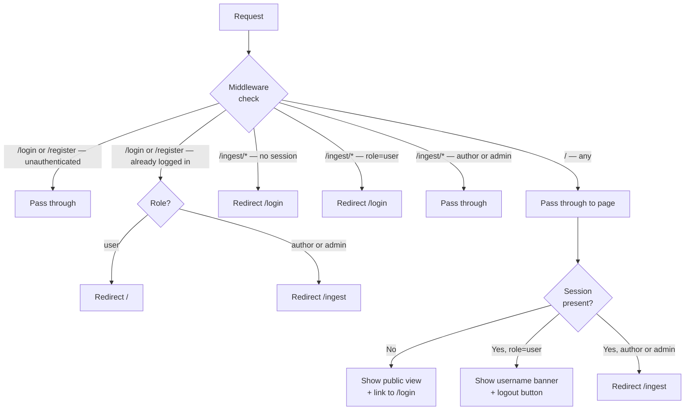

# Feature: Auth Module — User Roles, Route Protection & Seed Script

**Status:** Approved
**Owner:** rjasino-fs
**Last Updated:** 2026-05-26

---

## Goal

Implement a complete authentication layer for SecondSeat: credential-based login/register for regular users, role-aware route protection via Next.js middleware, and a seed script that provisions the first author and admin accounts from environment variables.

## Stakeholders

- **Requestor:** rjasino-fs (solo sprint owner)
- **Users affected:** All three roles — `user` (regular player), `author` (content creator), `admin` (operator)
- **Teams involved:** Frontend (Next.js pages + middleware), Backend (Next.js Route Handlers)

---

## User Stories

### Story 1: Regular User Registration

**As a** prospective player,
**I want to** create an account at `/register`,
**So that** I can log in and use the SecondSeat hint companion.

#### Acceptance Criteria

- **Given** I am unauthenticated, **When** I visit `/register`, **Then** I see a form with Name, Email, Password, and Confirm Password fields.
- **Given** I submit a valid form, **When** the server creates the account, **Then** my `role` is always set to `"user"` — authors/admins cannot self-register.
- **Given** I submit mismatching passwords, **When** the form is validated, **Then** an inline error is shown and no account is created.
- **Given** an email already in use, **When** the server responds `409`, **Then** the form shows "Email already registered."
- **Given** registration succeeds, **When** the session is written, **Then** I am redirected to `/` (the player landing page).
- **Given** I am already logged in, **When** I visit `/register`, **Then** middleware redirects me based on my role (users → `/`, authors/admins → `/ingest`).

### Story 2: Login

**As a** user with any role,
**I want to** log in at `/login` with my email and password,
**So that** I can access the features available to my role.

#### Acceptance Criteria

- **Given** valid credentials for a `"user"`, **When** login succeeds, **Then** I am redirected to `/`.
- **Given** valid credentials for `"author"` or `"admin"`, **When** login succeeds, **Then** I am redirected to `/ingest`.
- **Given** invalid credentials, **When** the server responds `401`, **Then** the form shows "Invalid email or password" (no hint about which field is wrong).
- **Given** I am already logged in, **When** I visit `/login`, **Then** middleware redirects me to my role's home (same as post-login redirect).
- **Given** login succeeds, **When** the `iron-session` cookie is set, **Then** it carries `httpOnly: true`, `secure: true` in production, `sameSite: "strict"`.

### Story 3: Player Landing Page

**As a** logged-in regular user,
**I want to** see a landing page at `/` that shows my display name and a logout button,
**So that** I have a clear entry point while the inference UI is being built.

#### Acceptance Criteria

- **Given** I am logged in as `"user"`, **When** I visit `/`, **Then** I see a banner with my `displayName` and a visible logout button.
- **Given** I click logout, **When** the session is destroyed, **Then** I am redirected back to `/` (which now shows the unauthenticated view / login prompt).
- **Given** I am unauthenticated, **When** I visit `/`, **Then** I see a public view with a link/button to `/login` (no banner, no logout).
- **Given** I am `"author"` or `"admin"`, **When** I visit `/`, **Then** middleware redirects me to `/ingest`.

### Story 4: Ingest Module Route Protection

**As** the Next.js middleware,
**I want to** enforce that only `"author"` and `"admin"` roles can reach `/ingest/*`,
**So that** regular users cannot access content-management screens.

#### Acceptance Criteria

- **Given** an unauthenticated request to `/ingest/*`, **When** middleware runs, **Then** redirect to `/login`.
- **Given** a `"user"` role session on `/ingest/*`, **When** middleware runs, **Then** redirect to `/login`.
- **Given** an `"author"` or `"admin"` session on `/ingest/*`, **When** middleware runs, **Then** the request passes through.
- **Given** an unauthenticated request to `/login` or `/register`, **When** middleware runs, **Then** the request passes through (no redirect loop).

### Story 5: Admin/Author Seed Script

**As** an operator deploying SecondSeat,
**I want to** run a seed script that provisions one admin and one author account from env vars,
**So that** those privileged roles exist without requiring a self-registration flow.

#### Acceptance Criteria

- **Given** all four env vars are present, **When** I run the script, **Then** both accounts are upserted (created or skipped if email already exists) without error.
- **Given** a seed account already exists in MongoDB, **When** the script runs again, **Then** it logs "already exists — skipping" and makes no changes.
- **Given** a required env var is missing, **When** the script starts, **Then** it exits with a non-zero code and a clear error message before touching the database.
- **Given** the script completes, **When** I check MongoDB, **Then** the admin document has `role: "admin"` and the author document has `role: "author"`, with passwords hashed via `argon2`.

---

## Data Requirements

The `IUser` Mongoose schema in `packages/db/src/models/user.model.ts` already covers all required fields. No schema migration is needed.

| Field          | Type     | Required | Constraints                                       | Notes                                    |
| -------------- | -------- | -------- | ------------------------------------------------- | ---------------------------------------- |
| `name`         | `String` | Yes      | Non-empty                                         | Used as display name in banner           |
| `email`        | `String` | Yes      | Unique index, lowercase, valid email format       | Login identifier                         |
| `passwordHash` | `String` | Yes      | argon2 hash                                       | Never stored or logged in plain text     |
| `role`         | `String` | Yes      | `"user" \| "admin" \| "author"`, default `"user"` | Register endpoint always writes `"user"` |

**Session payload** (`SessionUser` in `apps/web/src/lib/session.ts` — already typed):

| Field         | Type     | Notes                           |
| ------------- | -------- | ------------------------------- |
| `id`          | `string` | MongoDB `_id.toString()`        |
| `email`       | `string` | Stored for display / audit      |
| `displayName` | `string` | From `user.name`                |
| `role`        | `string` | `"user" \| "admin" \| "author"` |

---

## Flow Diagram



---

## API Contract

All routes live inside `apps/web` as Next.js Route Handlers.

| Method | Endpoint             | Auth Required | Description                                                           |
| ------ | -------------------- | ------------- | --------------------------------------------------------------------- |
| POST   | `/api/auth/login`    | No            | Verifies credentials, writes `iron-session`, returns `SessionUser`    |
| POST   | `/api/auth/register` | No            | Creates `role: "user"` account, writes session, returns `SessionUser` |
| GET    | `/api/auth/logout`   | No            | Destroys session, redirects to `/` _(already implemented)_            |

### `POST /api/auth/login`

**Request body (Zod-validated):**

```ts
{ email: z.string().email(), password: z.string().min(1) }
```

**Success `200`:**

```json
{ "id": "...", "email": "...", "displayName": "...", "role": "user" }
```

**Errors:**

- `401` — invalid credentials (single generic message, no field hint)
- `422` — request body fails Zod validation

### `POST /api/auth/register`

**Request body (Zod-validated):**

```ts
{
  name: z.string().min(1).max(100),
  email: z.string().email(),
  password: z.string().min(8),
  confirmPassword: z.string()
}
// refined: password === confirmPassword
```

**Success `201`:**

```json
{ "id": "...", "email": "...", "displayName": "...", "role": "user" }
```

**Errors:**

- `409` — email already registered
- `422` — body fails Zod validation (includes password mismatch)

---

## Edge Cases

- **Double-submit on register:** The route handler must check for existing email before insert; duplicate key from MongoDB is caught and returned as `409`, not `500`.
- **Network failure during login:** The form shows a generic "Something went wrong" error; no session is written.
- **Seeded account re-run:** Seed script uses `findOne({ email })` before attempting insert — fully idempotent, no `upsert` that could silently overwrite an existing password.
- **`displayName` sync:** The register route handler writes `name` to both the top-level `user.name` field and `user.profile.displayName`, keeping them in sync for future profile pages. The session and banner always use `user.name` (which is required), so there is no empty-banner risk.
- **Session secret missing at startup:** `loadConfig()` already throws if `SESSION_SECRET` is absent or under 32 chars — no additional guard needed.
- **Author/admin visits `/`:** Middleware redirects to `/ingest` before the page renders — no flash of the player landing page.
- **Concurrent seed runs:** Not a concern for a one-off dev script; no distributed locking needed.

---

## Out of Scope

- Password reset / forgot-password flow — not needed for MVP.
- Email verification on registration — not needed for MVP.
- OAuth / social login — not in tech stack.
- Multi-session management or forced logout of other devices.
- Fine-grained RBAC beyond the three roles (no per-resource permissions).
- `/register` blocked for logged-in users via a UI affordance — middleware handles it silently via redirect.
- Any inference UI for regular users — `/` landing page is a placeholder banner only.

---

## Open Questions

✅ ~~Should a `"user"` who navigates to `/ingest` be shown a `403` page rather than silently redirected to `/`?~~ — **Resolved:** redirect to `/login` for both unauthenticated and wrong-role requests to `/ingest/*`.

✅ ~~Should the register form also populate `profile.displayName` with the same value to keep them in sync?~~ — **Resolved:** yes, write `name` to both `user.name` and `user.profile.displayName` on register and seed.

✅ ~~Seed script runner: confirm `tsx` vs `ts-node`.~~ — **Resolved:** `tsx` is already used in `apps/workers`. Add `tsx` as a devDependency to `packages/db`. `argon2` must also be installed in both `apps/web` and `packages/db` (not yet present in either). Run script via `tsx --env-file=.env packages/db/scripts/seed-admins.ts`.

---

## Dependencies

- **Depends on:** `packages/db` User model (already implemented), `iron-session` + `SESSION_SECRET` (already scaffolded in `apps/web/src/lib/session.ts`), `argon2` (must be added to `apps/web` and `packages/db` if not yet installed)
- **Blocks:** Inference UI for regular users (Epic II), any feature that requires an authenticated session in `apps/inference`
