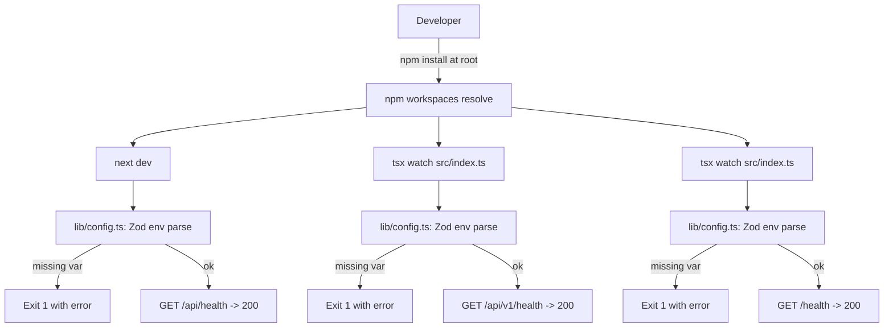

# Feature: Monorepo Scaffold with Health Checks

**Status:** Approved
**Owner:** rjasino-fs
**Last Updated:** 2026-05-26

---

## Goal

Stand up the npm-workspaces monorepo defined in [docs/sdd.md](../sdd.md) (three apps, two shared packages, local infra) so every subsequent feature lands on a consistent, rule-compliant skeleton. Only liveness health checks are exposed in this scaffold — no product behavior.

## Stakeholders

- **Requestor:** rjasino-fs (project owner)
- **Users affected:** Solo developer on the SG Tech Week sprint; no end-user impact yet.
- **Teams involved:** Backend, Frontend

---

## User Stories

### Story 1: Bootable monorepo

**As a** developer working on SecondSeat,
**I want to** clone the repo and start each app workspace,
**So that** I can verify the platform is alive before building any feature on top of it.

#### Acceptance Criteria

- **Given** a fresh clone and `npm install` at the root, **When** I run each app's dev script, **Then** all three apps (`web`, `inference`, `workers`) start without errors.
- **Given** all three apps are running, **When** I `GET` each app's health endpoint, **Then** I receive `200` with `{ status: "ok", service: <name>, timestamp: <ISO 8601> }`.
- **Given** any required env var is missing at startup, **When** an app boots, **Then** it fails fast with a Zod validation error naming the missing key (per [security.md](../../.claude/rules/security.md)).

### Story 2: Rule-compliant skeleton

**As a** developer adding the first real feature,
**I want to** find helmet, rate-limiting, central error handling, `catchAsync`, and Zod already wired into the Express inference app,
**So that** I don't have to retrofit security or validation patterns after features land.

#### Acceptance Criteria

- **Given** the Express app, **When** I inspect `app.ts`, **Then** `helmet`, `express-rate-limit`, JSON body parser, route mount, and a centralized error handler are registered in that order.
- **Given** the `/api/v1/health` route, **When** I read the handler, **Then** it is wrapped by `catchAsync` and uses a Zod schema for its response shape.
- **Given** any app workspace, **When** I read its `tsconfig.json`, **Then** `"strict": true` is set and it extends `tsconfig.base.json`.

### Story 3: Smoke-tested harness

**As a** developer,
**I want to** run `npm test` at the root and see every app's health endpoint test pass,
**So that** I know the Vitest + Supertest harness is functional before writing real tests.

#### Acceptance Criteria

- **Given** the root, **When** I run `npm test`, **Then** Vitest runs in each workspace and at least one health-route smoke test passes per app.
- **Given** the smoke test for an Express app, **When** it runs, **Then** it uses Supertest against the in-process app (no real port bound).

---

## Data Requirements

No persistent data is written or read by this scaffold. Health endpoints return ephemeral process metadata only.

| Field       | Type   | Required | Constraints                                | Notes                                                 |
| ----------- | ------ | -------- | ------------------------------------------ | ----------------------------------------------------- |
| `status`    | string | ✅       | Literal `"ok"`                             | Liveness signal only.                                 |
| `service`   | string | ✅       | One of `"web"`, `"inference"`, `"workers"` | Identifies the responding process.                    |
| `timestamp` | string | ✅       | ISO 8601 UTC                               | Generated per request via `new Date().toISOString()`. |

---

## Flow Diagram

---

## API Contract (for @backend-dev)

All endpoints return `200 OK` with `{ status: "ok", service, timestamp }`. None require auth — they exist before the auth layer is built.

| Method | Endpoint         | Auth | Description                                                                    |
| ------ | ---------------- | ---- | ------------------------------------------------------------------------------ |
| GET    | `/api/health`    | ❌   | Liveness probe for `apps/web` (Next.js Route Handler)                          |
| GET    | `/api/v1/health` | ❌   | Liveness probe for `apps/inference` (Express)                                  |
| GET    | `/health`        | ❌   | Liveness probe for `apps/workers` (tiny HTTP server bound to a dedicated port) |

---

## Edge Cases

- **Missing env vars at startup** → Zod throws; process exits non-zero with a message naming the missing key. Documented in `.env.example`.
- **Port already in use** → Node's default `EADDRINUSE` error is allowed to surface; no custom handling.
- **Health hit before app fully boots** → Not possible: each app binds its port only after `config` parsing succeeds; pre-bind hits get connection refused, which is correct.
- **Rate limit on `/api/v1/health`** → `express-rate-limit` applies its global default; the health endpoint is intentionally subject to the same baseline to prove the middleware is wired. A health-specific bypass can land when monitoring is wired up.
- **Workers process crashes** → Out of scope; restart/process-supervision is a deployment concern, not a scaffold concern.
- **Concurrent `npm test`** → Vitest workspaces run in parallel by default; the smoke tests use Supertest with no port binding, so there is no port contention.

---

## Out of Scope

- Authentication (`iron-session`, JWT verification on Express).
- Ingestion endpoints (`/api/ingest`, `/api/ingest/status/:jobId`).
- Generation endpoints (`/api/v1/generate`, SSE streaming, `/api/v1/session/*`).
- LlamaIndex.TS wiring, `LlmAdapter`, Anthropic / OpenCode Zen SDK setup.
- ChromaDB client integration, BullMQ queue/job registration, embedding model load (`@xenova/transformers`).
- Mongoose models, `@secondseat/db` real connection logic, `@secondseat/embedding` real model logic — both packages ship as stubs.
- Voice (Web Speech API, wake phrase, VAD), TTS sidecar.
- Playwright E2E setup and any UI beyond a placeholder root page.
- CI workflow files, deployment configs, Dockerfiles for the apps themselves (only infra services are in `docker-compose.yml`).
- Auth-driven readiness checks or dependency pings (Mongo / Redis / Chroma reachability) — confirmed liveness-only per clarification.

---

## Open Questions

_All resolved 2026-05-26:_

- ✅ **Worker health probe port** → required via env (no default fallback). `WORKER_HEALTH_PORT` listed in `apps/workers/.env.example`; Zod config parses it as a number and fails fast if missing. Same convention applied to `WEB_PORT` and `INFERENCE_PORT` for consistency.
- ✅ **Tailwind in `apps/web`** → configure **TailwindCSS 4** per SDD §1: `tailwind.config.ts`, `postcss.config.mjs`, `globals.css` with the v4 `@import "tailwindcss";` directive. Placeholder root page renders a single Tailwind-styled element so a smoke test can assert the utility class is applied (proving the build pipeline works).
- ✅ **ESLint / Prettier** → skipped in this scaffold.

---

## Dependencies

- **Depends on:** Local Node.js (≥ 20 LTS recommended for Next.js 14+ and native `fetch`), npm 10+ for workspaces. Docker Desktop required only to run `docker-compose.yml`, not to run the apps themselves.
- **Blocks:** Every subsequent feature spec — ingestion pipeline (Epic I-A/I-B/I-C status in [CLAUDE.md](../../CLAUDE.md) suggests these are partially built; this scaffold supersedes any ad-hoc structure and they will need to be re-anchored on it), inference stream, auth, voice input.
