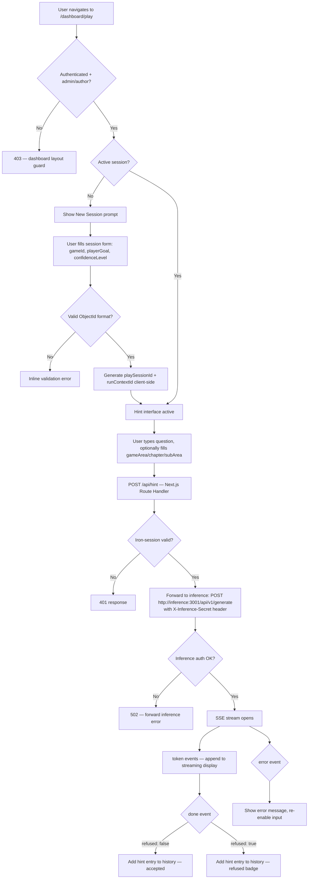

# Feature: Web Inference UI — Player Hint Test Page

**Status:** Approved
**Owner:** rjasino-fs
**Last Updated:** 2026-05-27

---

## Goal

Build a `/dashboard/play` test page that lets admin/author users exercise the live inference endpoint — sending hint requests, streaming responses in real time, and reviewing session history — so the full web ↔ inference pipeline can be verified end-to-end without an external tool.

## Stakeholders

- **Requestor:** rjasino-fs
- **Users affected:** Admin and author roles (internal testers)
- **Teams involved:** Frontend (Next.js), Backend (Express inference service)

---

## User Stories

### Story 1: Start a Play Session

**As an** admin or author,
**I want to** create a new play session by supplying a game ID and my current goal/confidence,
**So that** I have a scoped context to send hint requests against.

#### Acceptance Criteria

- **Given** I am on `/dashboard/play` with no active session, **When** the page loads, **Then** I see only a "New Session" button and a prompt to start
- **Given** I click "New Session", **When** the session form appears, **Then** I can enter `gameId` (ObjectId text field), select `playerGoal`, and select `confidenceLevel`
- **Given** I submit the session form with a valid ObjectId and both selects filled, **When** the form submits, **Then** a `playSessionId` and `runContextId` are generated client-side and the hint interface becomes active
- **Given** I submit the session form with an invalid ObjectId format, **When** I submit, **Then** an inline validation error is shown and submission is blocked
- **Given** an active session exists, **When** I click "New Session", **Then** the previous session's hint history is cleared and a fresh session begins

---

### Story 2: Send a Hint Request and Stream the Response

**As an** admin or author with an active session,
**I want to** type a question and optionally specify where I am in the game,
**So that** I can see the inference service stream back a spoiler-safe hint in real time.

#### Acceptance Criteria

- **Given** an active session, **When** I type a question in the hint input and submit, **Then** a `POST /api/hint` request is made with the full request body
- **Given** the request is sent, **When** SSE tokens arrive, **Then** each token is appended to the streaming display immediately as it arrives
- **Given** the SSE `done` event fires, **When** `refused: false`, **Then** the streamed text is shown as a completed hint in the history panel
- **Given** the SSE `done` event fires, **When** `refused: true`, **Then** the response is shown with a distinct "Refused" badge and `refusalReason` label
- **Given** the SSE `error` event fires, **When** it arrives, **Then** an error message replaces the streaming display and the input is re-enabled
- **Given** a hint request is in-flight, **When** I try to submit another, **Then** the submit button is disabled until the current stream completes
- **Given** `gameArea` or `chapter` are empty, **When** the user tries to submit, **Then** inline validation errors are shown and submission is blocked
- **Given** `subArea` is empty, **When** submitting, **Then** it is omitted from the request body (not sent as empty string)

---

### Story 3: Review Session Hint History

**As an** admin or author,
**I want to** see all hint request/response pairs from the current session,
**So that** I can review the inference behaviour across multiple turns.

#### Acceptance Criteria

- **Given** hints have been generated, **When** I look at the history panel, **Then** each entry shows the question, the response text, `lineCount`, and a refused/accepted badge
- **Given** a new hint is completed, **When** the `done` event fires, **Then** the new entry is appended at the bottom of the history list
- **Given** no hints exist yet in the session, **When** I view the history panel, **Then** a "No hints yet" placeholder is shown

---

### Story 4: Navigate to the Play Page

**As an** admin or author,
**I want to** see a "Play" nav link in the dashboard,
**So that** I can reach `/dashboard/play` without typing the URL manually.

#### Acceptance Criteria

- **Given** I am logged in as admin or author, **When** I view the dashboard nav, **Then** a "Play" link is visible alongside "Ingestion"
- **Given** I am logged in as `user` role, **When** I try to access `/dashboard/play`, **Then** I am shown the existing 403 page (enforced by the dashboard layout auth guard)

---

## Data Requirements

### Request body — `POST /api/hint` (web → inference proxy)

| Field             | Type                                                        | Required | Constraints              | Notes                                              |
|-------------------|-------------------------------------------------------------|----------|--------------------------|----------------------------------------------------|
| `playSessionId`   | string                                                      | ✅       | Valid MongoDB ObjectId   | Generated client-side on session start             |
| `runContextId`    | string                                                      | ✅       | Valid MongoDB ObjectId   | Generated client-side on session start; stub field |
| `gameId`          | string                                                      | ✅       | Valid MongoDB ObjectId   | Entered by tester; must match ingested game data   |
| `gameArea`        | string                                                      | ✅       | 1–100 chars              | Supplied manually by tester in hint form           |
| `chapter`         | string                                                      | ✅       | 1–100 chars              | Supplied manually by tester in hint form           |
| `subArea`         | string                                                      | ❌       | 1–100 chars if present   | Optional per inference schema; omitted when empty  |
| `playerGoal`      | `progression \| exploration \| confirmation \| completion`  | ✅       | Enum                     | Set at session start, sticky for the session       |
| `confidenceLevel` | `confident \| uncertain \| stuck`                           | ✅       | Enum                     | Set at session start, sticky for the session       |
| `text`            | string                                                      | ✅       | 1–500 chars              | The player's hint question                         |

### Session state (client-side only — no DB write for this test page)

| Field             | Type   | Source                           |
|-------------------|--------|----------------------------------|
| `playSessionId`   | string | `new ObjectId().toString()` on session start |
| `runContextId`    | string | `new ObjectId().toString()` on session start |
| `gameId`          | string | User input                       |
| `playerGoal`      | string | User input                       |
| `confidenceLevel` | string | User input                       |

### New env vars required in `apps/web`

| Var                        | Description                                             |
|----------------------------|---------------------------------------------------------|
| `INFERENCE_URL`            | Base URL of the inference service (e.g. `http://localhost:3001`) |
| `INFERENCE_SERVICE_SECRET` | Shared secret forwarded as `X-Inference-Secret` header |

Both must be added to `apps/web/.env.example`, `apps/web/.env.local`, and `apps/web/src/lib/config.ts`.

---

## Flow Diagram

---

## API Contract

### New route in `apps/web`

| Method | Endpoint    | Auth         | Description                                                 |
|--------|-------------|--------------|-------------------------------------------------------------|
| POST   | `/api/hint` | iron-session | Proxy hint request to inference service, stream SSE back    |

**Request body:** `GenerateRequest` shape (see Data Requirements above)

**Response:** `text/event-stream` — SSE passthrough from inference service:
- `data: {"token": "..."}` — streamed text token
- `event: done\ndata: {"lineCount": N, "refused": bool, "refusalReason": string|null}` — terminal event
- `event: error\ndata: {"message": "..."}` — error event

**Error responses:**
- `401` — no valid session
- `422` — request body fails Zod validation in web proxy
- `502` — inference service unreachable or returned non-2xx

---

## Implementation Plan

### Sub-task 1 — Web config + env wiring
- Add `INFERENCE_URL` and `INFERENCE_SERVICE_SECRET` to `apps/web/src/lib/config.ts` as `requireEnv()` calls
- Add both to `apps/web/.env.example` with placeholder values
- Update `apps/web/.env.local` with real local values

### Sub-task 2 — Proxy route (`apps/web/src/app/api/hint/route.ts`)
- Validate request body with the same `generateSchema` Zod shape (imported or duplicated)
- Check iron-session; return `401` if no valid session
- `fetch()` to `INFERENCE_URL/api/v1/generate` with `X-Inference-Secret` header
- Pipe the response body as a `ReadableStream` back to the client with `Content-Type: text/event-stream`
- Return `502` if the upstream fetch fails

### Sub-task 3 — Play page UI
Files:
- `apps/web/src/app/(dashboard)/dashboard/play/page.tsx` — server component, auth checked by layout
- `apps/web/src/app/(dashboard)/dashboard/play/PlayClient.tsx` — `"use client"` — all session + SSE state
- `apps/web/src/app/(dashboard)/layout.tsx` — add "Play" nav link

`PlayClient` component responsibilities:
- Session state: `{ gameId, playerGoal, confidenceLevel, playSessionId, runContextId } | null`
- Hint form state: `text`, `gameArea?`, `chapter?`, `subArea?`
- Stream state: `streaming: boolean`, `currentTokens: string`
- History: `HintEntry[]` — `{ question, response, lineCount, refused, refusalReason }`
- On submit: open `EventSource`-compatible fetch, consume SSE tokens, commit to history on `done`

### Sub-task 4 — Tests
- `apps/web/src/app/api/hint/route.test.ts` (Vitest + `node-fetch` mock or `msw`)
  - Assert `401` with no session
  - Assert `422` with invalid body
  - Assert SSE passthrough on valid request (mock inference response)

---

## Edge Cases

- **Double submit:** Submit button disabled while `streaming: true`; re-enabled on `done` or `error`
- **Inference service down:** `fetch` rejects → proxy returns `502` → UI shows error message
- **Stream timeout:** Inference has a 30 s LLM timeout — the SSE connection will close naturally; UI should handle `close` event on the `ReadableStream` gracefully
- **Empty required fields:** `gameArea` and `chapter` validated client-side before submission; `subArea` omitted from body when blank
- **Invalid gameId ObjectId:** Client-side regex validation on session form before submission
- **Session with no matching RAG data:** Inference returns `refused: true` with `refusalReason: insufficient_context` — UI shows refused badge; this is expected behaviour for test scenarios without ingested content

---

## Out of Scope

- Voice input (Web Speech API / "Hey SS" wake phrase) — text only for this iteration
- Persisting `play_sessions` to MongoDB — client-side only session state
- `playerGoal` / `confidenceLevel` update mid-session — sticky until "New Session"
- Hint overlay positioning, opacity, or accessibility settings from the user profile
- TTS hint readout (Pocket TTS sidecar)
- Game selector dropdown (requires populated `games` collection) — ObjectId text input only

---

## Open Questions

✅ ~~`gameArea`, `chapter`, `subArea` — optional vs required?~~ **Resolved 2026-05-27:** `gameArea` and `chapter` are required fields in the test UI, supplied manually by the tester. `subArea` remains optional (already `.optional()` in the inference schema). Auto-inference of these fields from query context is deferred to a future discussion.

---

## Dependencies

- **Depends on:** Inference app (`apps/inference`) — must be running at `INFERENCE_URL`; fully implemented ✅
- **Depends on:** At least one ingested RAG source with a known `gameId` for end-to-end testing
- **Blocks:** Player-facing companion UI (the production second-screen overlay, future spec)
