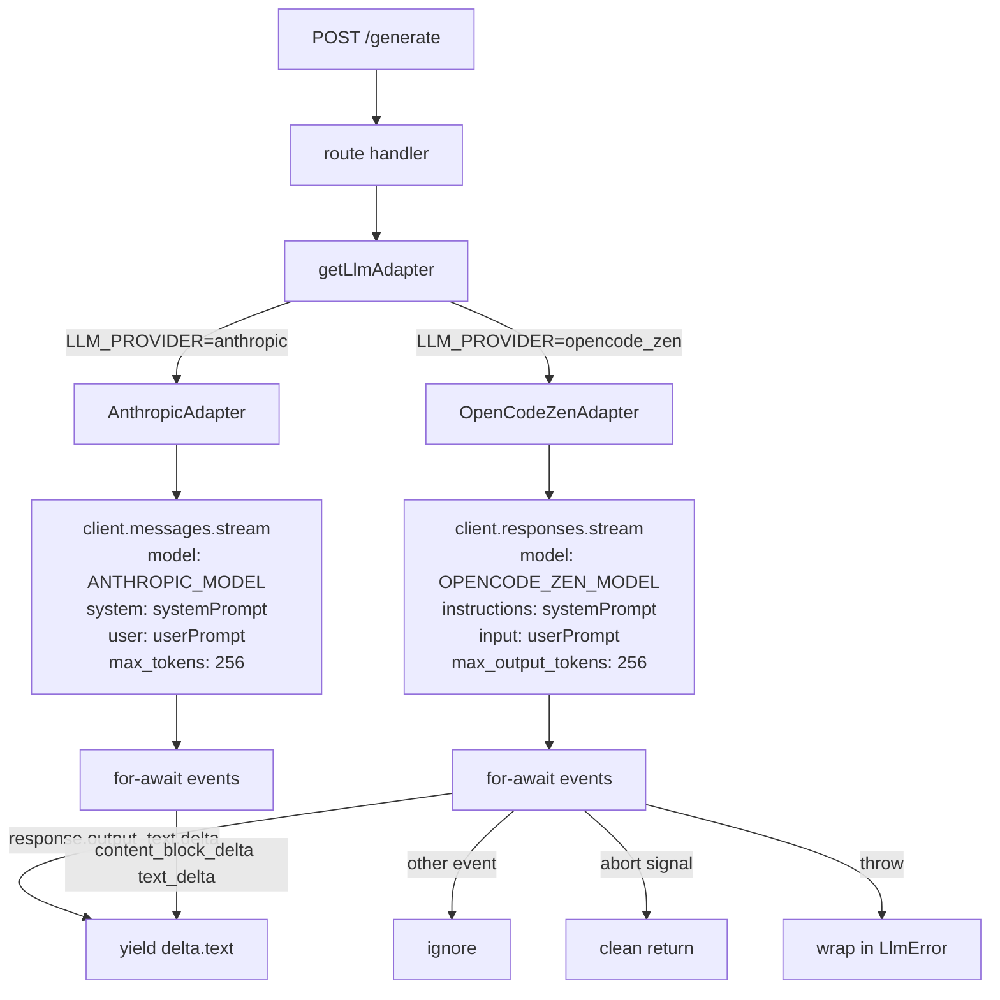

# Feature: OpenCode Zen Responses API + Configurable LLM Model

**Status:** Draft
**Owner:** rjasino-fs
**Last Updated:** 2026-05-28

---

## Goal

Replace the broken Chat-Completions integration in `OpenCodeZenAdapter` with OpenCode Zen's Responses API (default model: `opencode/claude-haiku-4-5`) so hint generation actually works, and make the model name configurable via env vars on both adapters so the active model can be swapped without code changes.

## Stakeholders

- **Requestor:** rjasino-fs
- **Users affected:** Anyone calling `POST /generate` on the inference service. Currently 100% failure (404 from OpenCode Zen base URL); after this spec, hints succeed.
- **Teams involved:** Backend (inference service only). No frontend or workers change.

---

## User Stories

### Story 1: Hints come back from the configured provider

**As a** SecondSeat player,
**I want to** receive a streamed 1–3 line hint when I submit a query,
**So that** I get help without breaking gameplay flow.

#### Acceptance Criteria

- **Given** `LLM_PROVIDER=opencode_zen`, `OPENCODE_ZEN_BASE_URL=https://opencode.ai/zen/v1`, `OPENCODE_ZEN_MODEL=opencode/claude-haiku-4-5`, and a valid `OPENCODE_ZEN_API_KEY`, **When** the route calls `getLlmAdapter().streamGenerate(systemPrompt, userPrompt)`, **Then** text chunks are yielded as they stream in, and no 404 is raised.
- **Given** the abort signal is triggered mid-stream, **When** the adapter's `for await` loop is interrupted, **Then** the iterator returns cleanly with no thrown `LlmError`.
- **Given** the upstream returns a 4xx/5xx, **When** the adapter catches the SDK error, **Then** it throws `LlmError("OpenCode Zen stream failed", err)` (unchanged from today — error mapping is out of scope).

### Story 2: Model is configurable via env

**As a** developer iterating on prompt quality during the sprint,
**I want to** swap the LLM model without editing source,
**So that** I can A/B between Claude Haiku, GPT-5 Nano, etc. via `.env.local`.

#### Acceptance Criteria

- **Given** `LLM_PROVIDER=opencode_zen` and `OPENCODE_ZEN_MODEL` is unset, **When** the inference service starts, **Then** startup fails fast with a clear error naming the missing env var (matching the existing `requireEnv` pattern).
- **Given** `LLM_PROVIDER=anthropic` and `ANTHROPIC_MODEL` is unset, **When** the inference service starts, **Then** startup fails fast with the same fail-fast behavior.
- **Given** both vars are set, **When** an adapter is constructed, **Then** the request sent to the SDK uses the env-provided model string verbatim.

### Story 3: Anthropic adapter stays in parity

**As a** maintainer,
**I want** both adapters to source their model id the same way,
**So that** there's no special case to remember when switching providers.

#### Acceptance Criteria

- **Given** `AnthropicAdapter` is constructed, **When** it issues `messages.stream`, **Then** the `model` field equals `inferenceConfig.ANTHROPIC_MODEL` (replacing the current hardcoded `claude-sonnet-4-6`).
- **Given** no other behavior of `AnthropicAdapter` changes, **Then** all existing prompt/stream/abort behavior is preserved.

---

## Data Requirements

No persisted data changes. Configuration-only:

| Field                   | Type   | Required                         | Constraints                                                         | Notes                                                                   |
| ----------------------- | ------ | -------------------------------- | ------------------------------------------------------------------- | ----------------------------------------------------------------------- |
| `OPENCODE_ZEN_BASE_URL` | string | when `LLM_PROVIDER=opencode_zen` | Must end at `/v1` (SDK appends `/responses` or `/chat/completions`) | Change existing value from `…/zen/v1/responses` to `…/zen/v1`.          |
| `OPENCODE_ZEN_MODEL`    | string | when `LLM_PROVIDER=opencode_zen` | Non-empty                                                           | New. Example: `opencode/claude-haiku-4-5`.                              |
| `OPENCODE_ZEN_API_KEY`  | string | when `LLM_PROVIDER=opencode_zen` | Non-empty                                                           | Unchanged.                                                              |
| `ANTHROPIC_MODEL`       | string | when `LLM_PROVIDER=anthropic`    | Non-empty                                                           | New. Default for `.env.example`: `claude-sonnet-4-6` (preserves today). |
| `ANTHROPIC_API_KEY`     | string | when `LLM_PROVIDER=anthropic`    | Non-empty                                                           | Unchanged.                                                              |

---

## Flow Diagram

---

## API Contract (for @backend-dev)

N/A — no HTTP contract change. The Express route surface is unchanged; this is an internal adapter rewrite behind the existing `LlmAdapter` interface.

---

## Edge Cases

- **Abort mid-stream.** `opts.abortSignal.aborted` after a throw → adapter returns cleanly, no `LlmError`. (Matches today's behavior.)
- **Upstream 404 / 4xx / 5xx.** Wrapped in `LlmError("OpenCode Zen stream failed", err)`. No refined mapping in this task.
- **Non-text events.** Responses streams emit many event types (`response.created`, `response.completed`, function-call deltas, etc.). Adapter must only yield on text-delta events and silently ignore the rest.
- **Empty deltas.** If `event.delta` is empty string, skip the yield to avoid noisy chunks downstream.
- **Missing model env var.** `requireEnv("OPENCODE_ZEN_MODEL")` throws at module load — fail-fast, consistent with the rest of `config.ts`.
- **Wrong base URL still present in user's `.env.local`.** Spec includes a manual step to update it; spec does not edit user secrets.
- **SDK version mismatch.** If the installed `openai` package doesn't expose `client.responses.create({ stream: true })` or uses a different streaming helper (e.g., `client.responses.stream(...)`), implementer must verify against `node_modules/openai` and adjust. Note recorded in Open Questions.

---

## Out of Scope

- Refined error mapping (4xx → typed error, model-not-found, quota exhausted, etc.). Stays as generic `LlmError`.
- Changes to `generate.route.ts`, prompt assembly, RAG retrieval, or spoiler-policy logic.
- Rewriting `AnthropicAdapter` beyond replacing the hardcoded model id.
- Reconciling `docs/data_model.md` with `packages/db` (deferred per project-owner decision, 2026-05-28).
- Adding a fallback chain between providers (single provider per env).
- Multi-turn `messages` semantics — confirmed unused.
- Updating user's `apps/inference/.env.local` (manual step for the owner — secrets are not touched by code).

---

## Open Questions

✅ **Resolved 2026-05-28** — SDK method.
Verified against installed `openai@4.104.0`. `client.responses.create(body, opts)` is overloaded: with `stream: true` in the body it returns `APIPromise<Stream<ResponseStreamEvent>>` — awaited, then async-iterable. A convenience `client.responses.stream(body, opts)` returning `ResponseStream` also exists.
**Decision:** use `client.responses.create({ ..., stream: true }, { signal })` — mirrors the existing chat-completions code pattern, smaller diff. Stream-event union includes `ResponseTextDeltaEvent` with `type: 'response.output_text.delta'` and `delta: string`. Non-text events (e.g. `response.created`, `response.completed`, tool-call deltas) are ignored.

⚠️ **Deferred** — Model id format (`opencode/claude-haiku-4-5` vs `claude-haiku-4-5`).
Owner does not have OpenCode docs handy to confirm right now. Since the model name is **already env-driven** in this spec, the implementation does not depend on the exact string — `.env.example` will use `opencode/claude-haiku-4-5` as the documented default; if OpenCode rejects it at runtime the owner edits `.env.local` only. No code change required. — Owner: project owner — Due: post-merge smoke test.

---

## Dependencies

- **Depends on:** OpenCode Zen account with credit and a valid API key (already provisioned per `.env.local`).
- **Blocks:** Any future work on the `/generate` hot path — until this lands, hint generation is broken with `LLM_PROVIDER=opencode_zen`.

---

## Files Touched (for implementer reference)

- `apps/inference/src/services/llm/opencode-zen.adapter.ts` — rewrite request body, switch to Responses streaming, translate events to text chunks.
- `apps/inference/src/services/llm/anthropic.adapter.ts` — replace `MODEL_ID` constant with `inferenceConfig.ANTHROPIC_MODEL`.
- `apps/inference/src/config/config.ts` — add `OPENCODE_ZEN_MODEL` and `ANTHROPIC_MODEL` to the validated config; fix the comment on `OPENCODE_ZEN_BASE_URL` to clarify it must end at `/v1`.
- `apps/inference/.env.example` — set `OPENCODE_ZEN_BASE_URL=https://opencode.ai/zen/v1`, add `OPENCODE_ZEN_MODEL=opencode/claude-haiku-4-5`, add `ANTHROPIC_MODEL=claude-sonnet-4-6`.
- `apps/inference/src/services/llm/opencode-zen.adapter.test.ts` — new file. Mock OpenAI SDK at the boundary; assert text deltas yielded in order, non-text events ignored, error wrapped as `LlmError`, abort returns cleanly.

## Manual Steps for Owner (post-merge)

1. Edit `apps/inference/.env.local`:
   - `OPENCODE_ZEN_BASE_URL=https://opencode.ai/zen/v1`
   - Add `OPENCODE_ZEN_MODEL=opencode/claude-haiku-4-5`
2. Restart the inference service.
3. Smoke-test `POST /generate` with a benign query and confirm text streams back.

---

Spec saved to docs/specs/SPEC-opencode-zen-responses-api.md. Please review and reply 'approved' to proceed.
