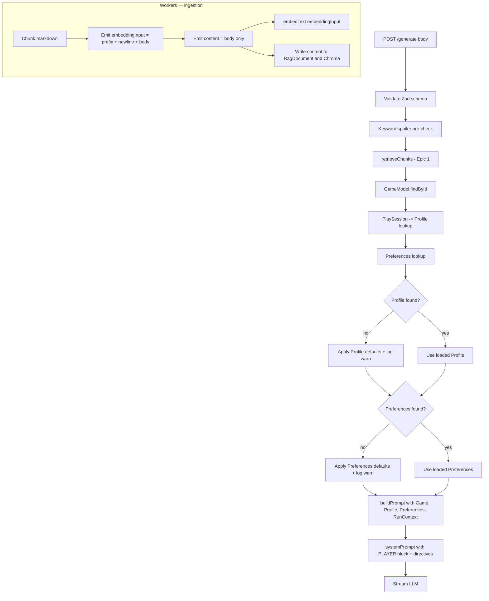

# Feature: Profile- and Goal-Aware Prompt Assembly

**Status:** Approved
**Owner:** rjasino-fs
**Last Updated:** 2026-05-29

---

## Goal

Make the inference service feed the LLM richer player context — the game title, the player's `hintPhilosophy`, `spoilerTolerance`, `maxHintLines`, and an explicit behavioral directive derived from `playerGoal` — and fix the duplicated heading line currently appearing in every retrieved chunk, so that hints are shaped by the player's stated preferences instead of one-size-fits-all defaults.

## Stakeholders

- **Requestor:** rjasino-fs
- **Users affected:** every caller of `POST /generate` on the inference service. Today the LLM has no idea which game is being played, no awareness of the player's hint-style preference, and sees each chunk's heading twice. After this spec, the prompt encodes those three signals and chunk text is clean.
- **Teams involved:** Backend (inference service + workers). No frontend changes in this spec — the player-facing UI for editing `Profile`/`Preferences` is tracked as a separate follow-up. No DB schema changes.

---

## User Stories

### Story 1: Inference loads Game, Profile, and Preferences per request

**As a** prompt assembler,
**I want** the route handler to load the active player's `Game`, `Profile`, and `Preferences` before assembling the prompt,
**So that** the assembled prompt can reflect the player's stated hint style and spoiler tolerance instead of hardcoded defaults.

#### Acceptance Criteria

- **Given** a valid `GenerateRequest` with `playSessionId` and `gameId`, **When** the route handler reaches the prompt-assembly step, **Then** it has executed three Mongo reads:
  1. `GameModel.findById(body.gameId).select("title").lean()`
  2. `PlaySessionModel.findById(body.playSessionId).select("userId").lean()` → `ProfileModel.findOne({ userId }).lean()`
  3. `PreferencesModel.findOne({ profileId: profile._id }).lean()`
- **Given** `Profile` is not found, **When** the handler continues, **Then** it falls back to a hardcoded `Profile`-shaped object with `hintPhilosophy: "directional"`, `spoilerTolerance: "low"`, and logs `[generate] missing profile for userId=<id>, falling back to defaults`.
- **Given** `Preferences` is not found, **When** the handler continues, **Then** it falls back to a hardcoded `Preferences`-shaped object with `maxHintLines: 3`, `defaultOutputMode: "text"`, `allowVoiceOutput: false`, `repeatHintCooldownSeconds: 60`, `autoRefuseSpoilers: false`, `confirmBeforeExplicitHint: false`, and logs `[generate] missing preferences for profileId=<id>, falling back to defaults`.
- **Given** `Game` is not found, **When** the handler continues, **Then** it throws (existing error middleware maps to 500). Unlike Profile/Preferences, an unknown `gameId` is a real client error and should not be silently masked.
- **Given** the three lookups succeed, **When** measured at the route boundary, **Then** the added Mongo latency is < 20 ms p95 in a warm-cache local dev environment. (Indexed lookups; included as a sanity floor, not a hard SLO.)

### Story 2: System prompt encodes Player block and behavioral directives

**As a** SecondSeat LLM,
**I want** the system prompt to tell me what game I'm guiding, the player's preferred hint style, their goal mode, and their spoiler tolerance,
**So that** my output respects the player's stated preferences instead of defaulting to one fixed tone.

#### Acceptance Criteria

- **Given** `buildPrompt` receives a fully populated `PromptSlots` with `game`, `profile`, `preferences`, and `runContext`, **When** the `systemPrompt` is composed, **Then** it contains a new `--- PLAYER ---` block placed between `--- GUIDE CONTEXT ---` and `--- PLAYER STATE ---`, formatted as:
  ```
  --- PLAYER ---
  Game: <game.title>
  Hint style: <profile.hintPhilosophy>
  Max lines: <preferences.maxHintLines>
  Spoiler tolerance: <profile.spoilerTolerance>
  ```
- **Given** the same input, **When** `systemPrompt` is composed, **Then** a single `HINT STYLE DIRECTIVE: <text>` line is appended immediately after the `--- PLAYER ---` block, with `<text>` selected by exhaustive `switch` on `hintPhilosophy`:
  | Value | Directive text |
  | :---------------- | :---------------------------------------------------------------------------- |
  | `minimal` | `Give the shortest useful nudge. Prefer 1 line over 3.` |
  | `directional` | `Point them toward the next action. Don't explain the solution.` |
  | `confirm_only` | `Only confirm or deny their guess. Don't suggest alternatives.` |
  | `explicit_opt_in` | `Default to refusing. Ask if they want a direct answer before giving hints.` |
- **Given** the same input, **When** `systemPrompt` is composed, **Then** a single `GOAL DIRECTIVE: <text>` line is appended immediately after the hint-style directive, with `<text>` selected by exhaustive `switch` on `runContext.playerGoal`:
  | Value | Directive text |
  | :------------- | :---------------------------------------------------------------------------------------------- |
  | `progression` | `They want to advance. Tell them the immediate next action.` |
  | `exploration` | `They want to discover, not advance. Point toward unexplored areas, not the path forward.` |
  | `confirmation` | `They want yes/no on a guess. Answer the guess directly — don't explain.` |
  | `completion` | `They're 100%-ing. Mention missables and collectibles, not story progression.` |
- **Given** any unknown enum value somehow reaches the switch (defensive case), **When** the switch falls through, **Then** the directive line is omitted (not rendered as `undefined`) and `console.warn` logs the unknown value with the field name.

### Story 3: Chunk content stored without the redundant heading prefix

**As a** prompt assembler,
**I want** each retrieved chunk to carry only its body text, not its heading line,
**So that** the `--- GUIDE CONTEXT ---` block doesn't show the heading path twice for every chunk.

#### Acceptance Criteria

- **Given** the markdown chunker (`apps/workers/src/services/chunk/node-parser.service.ts`) produces a chunk, **When** the chunker returns, **Then** the chunk has two distinct fields: `embeddingInput` (currently `${prefix}\n${body}`, used as the input to `embedText()`) and `content` (just `${body}`, persisted to `RagDocument.content` and Chroma's `documents`).
- **Given** the ingestion processor writes the chunk, **When** it calls `embedText(...)`, **Then** the value passed is `chunk.embeddingInput`. **When** it writes to `RagDocument` and `upsertVectors`, **Then** the value passed is `chunk.content` (no heading prefix).
- **Given** an existing chunk whose body itself genuinely begins with a `[...]` marker that is not the heading (unlikely but possible), **When** the chunker outputs `content`, **Then** only the very first line is stripped if and only if it matches `[${section.headingPath}]` exactly. Any other `[...]` lines are preserved.
- **Given** the inference service retrieves a chunk and feeds it into `buildPrompt`, **When** the chunk is formatted, **Then** the heading path is rendered exactly once (by `formatChunks` in `prompt-template.ts`), not twice as today.
- **Given** the unit test for `chunkText`, **When** it inspects the returned chunks for a known input with at least one heading, **Then** no chunk's `content` field starts with `[`.

---

## Data Requirements

No DB schema change. Two type extensions only:

| Field                       | Type   | Required | Constraints                         | Notes                                                                                         |
| --------------------------- | ------ | -------- | ----------------------------------- | --------------------------------------------------------------------------------------------- |
| `PromptSlots.game`          | object | yes      | `{ title: string }`                 | New. Threaded from the route handler.                                                         |
| `PromptSlots.profile`       | object | yes      | Subset of `IProfile`                | New. Pulled from Mongo or defaults. Shape: `{ hintPhilosophy, spoilerTolerance }`.            |
| `PromptSlots.preferences`   | object | yes      | Subset of `IPreferences`            | New. Pulled from Mongo or defaults. Shape: `{ maxHintLines }`.                                |
| `Chunk.embeddingInput`      | string | yes      | Non-empty                           | New. The text passed to `embedText()`. Equals `${[headingPath]}\n${body}`.                    |
| `Chunk.content` (semantics) | string | yes      | No leading `[<headingPath>]\n` line | **Semantics change.** Existing field, but now stores body only, not body-plus-heading-prefix. |

Backfill: same operator action as Epic 1 — drop the Chroma collection and re-ingest. Recommend bundling with the Epic 1 backfill (one window covers both).

---

## Flow Diagram



---

## API Contract (for @backend-dev)

No public HTTP contract changes. `POST /generate` request/response shapes are untouched.

**Internal contract changes:**

| Symbol                        | Before                                                           | After                                                                                                                              |
| ----------------------------- | ---------------------------------------------------------------- | ---------------------------------------------------------------------------------------------------------------------------------- |
| `PromptSlots` (type)          | `{ playerQuestion, retrievedChunks, runContext, sessionMemory }` | Adds `game: { title }`, `profile: { hintPhilosophy, spoilerTolerance }`, `preferences: { maxHintLines }`.                          |
| `Chunk` (worker chunker type) | `{ content, headingPath, chunkIndex, tokens, hash }`             | Adds `embeddingInput: string`. `content` semantics narrow to "body only".                                                          |
| `buildPrompt` (function)      | Returns `{ systemPrompt, userPrompt }` from existing slots.      | Same return shape; new internal `<player>` block + directives.                                                                     |
| Route handler                 | Looks up nothing besides what `retrieveChunks` does internally.  | Adds three Mongo lookups (Game, PlaySession→Profile, Preferences) before `buildPrompt`, with defaults fallback for the latter two. |

---

## Edge Cases

- **`Profile` missing in DB** — apply hardcoded defaults (`directional` / `low`) and log a warning. Player still gets a hint; the demo doesn't fail closed.
- **`Preferences` missing in DB** — apply hardcoded defaults (`maxHintLines: 3` and the rest). Same rationale.
- **`Game` missing in DB** — throw. Unlike profile/preferences, an unknown `gameId` is a genuine client error, not a missing user-data row.
- **`PlaySession` missing in DB** — throw (existing behavior; the session id was validated as a 24-char ObjectId in the Zod schema but its existence is not).
- **Unknown enum value reaches the directive `switch`** — omit the directive line, `console.warn`. Defensive; in practice TypeScript's `as const` types should prevent this at compile time.
- **Player asks a generic question with no game-area signal** — `<player>` block still renders. Directives still apply.
- **`maxHintLines` is set to something other than 3** — the prompt advertises `Max lines: <n>` to the LLM, but the existing `trimToThreeLines` post-processor in `generate.route.ts:24` still hard-caps at 3. Either align them (read `maxHintLines` into the trimmer) or document the cap as a hard product floor that overrides preference. **See Open Questions.**
- **Player has chosen `confirm_only` but the question isn't a yes/no** — model behavior is at the LLM's discretion; we encode the directive and trust the LLM to interpret it.
- **Chunk content genuinely starts with `[…]`** (e.g. a step note like `[Optional] Search the corner`) — the strip rule only matches the chunker's own `[${section.headingPath}]` line at index 0; non-matching `[…]` lines are preserved. See Story 3 AC.
- **Re-ingest interleaves with live traffic** — operator drops + re-ingests during a maintenance window. Inference will return zero chunks until ingestion completes; existing `(no guide content retrieved)` path handles it.
- **Old chunks (pre-Epic 2) still in Chroma after deploy** — they keep the duplicated heading. The fallback Chroma query may still return them. Acceptable until the backfill window completes.

---

## Out of Scope

- **XML/tagged chunk formatting** (`<chunk relevance="…">`) — visual polish, deferred.
- **Insufficient-context refusal taxonomy in the prompt** — deferred; the existing `(no guide content retrieved)` path is acceptable.
- **User-prompt restatement with context** — system prompt already carries the `--- PLAYER STATE ---` block; redundancy benefit is small enough to defer.
- **Server-side spoiler enforcement** (Epic 1 follow-up `S4`).
- **k-decoupling + reranking** (`S5`) and **HyDE-lite query expansion** (`S6`).
- **Frontend for Profile/Preferences onboarding** — tracked as a separate follow-up. Until then, the defaults-fallback path is what every demo user will exercise.
- **Aligning `trimToThreeLines` cap with `preferences.maxHintLines`** — deferred; the existing hard 3-line cap is a product floor and remains authoritative. See Open Questions.
- **Cross-session learning of preferences** — out of MVP, per [CLAUDE.md](CLAUDE.md) "Session memory is lightweight".

---

## Open Questions

_All open questions resolved 2026-05-29 — decisions folded into the spec body above:_

- ✅ `trimToThreeLines` retains its hard 3-line cap. `preferences.maxHintLines` is advertised in the prompt only. Revisited when the Profile/Preferences frontend spec lands.
- ✅ Defaults live in a new module `apps/inference/src/lib/defaults.ts` so the same constants will seed records when the frontend ships.
- ✅ Every defaults-fallback emits a single grep-able log token per request (`[generate] profile_missing` / `[generate] preferences_missing`) so demo logs are countable.

---

## Dependencies

- **Depends on:**
  - **SPEC-context-aware-retrieval (Epic 1)** — already merged. This spec assumes `retrieveChunks(query, gameId, runContext)` is the live signature.
  - `@secondseat/db` re-exports for `GameModel`, `ProfileModel`, `PreferencesModel`, `PlaySessionModel` — already in place.
- **Blocks:**
  - **Frontend onboarding for Profile/Preferences** — until this ships, the player UI has no surface to write these records; defaults-fallback will be the live path. (Tracked as separate spawned task after this commit lands.)
