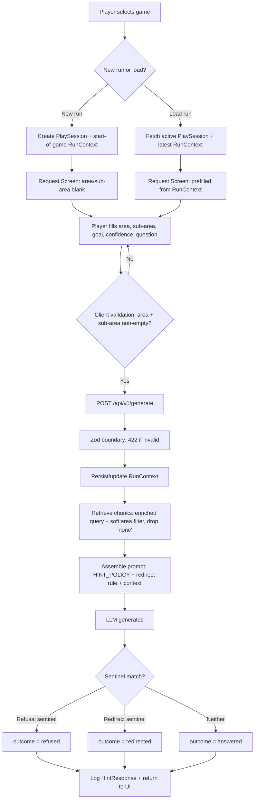

# Feature: Contextual Hint Refinement — Required Run Context + Out-of-Scope Redirect

**Status:** Approved
**Owner:** rjasino-fs
**Last Updated:** 2026-05-30

---

## Goal

Make hints sharp and on-brand by forcing precise run context (area + sub-area) into every request and redirecting out-of-scope "strategy/build" questions, so SecondSeat stays a situational micro-hint companion instead of a weak walkthrough engine — **without** loosening the 1–3 line cap.

## Stakeholders

- **Requestor:** rjasino-fs (solo project owner)
- **Users affected:** Players asking for hints during a play session.
- **Teams involved:** Backend (`apps/inference`, `packages/db`), Frontend (`apps/web`).

---

## Problem & Rationale

The 1–3 line cap feels unhelpful for "what build / best strategy / how to beat" questions. The real cause is that those are **out-of-scope walkthrough-engine questions**, not that 3 lines is too short. SecondSeat's value is situational micro-hints — _"stuck on the clock tower puzzle" → "Find the small gear, put it on the large gear, then place the small gear below to solve it."_ **Precise location in → precise hint out.** The fix is **input shaping** (require run context) plus **redirecting** out-of-scope questions. The line cap stays.

`gameArea`/`subArea` feed **both** the enriched embedding query ([retrieval.service.ts:46](../../apps/inference/src/services/retrieval/retrieval.service.ts)) **and** the Chroma metadata `$or` filter ([retrieval.service.ts:68](../../apps/inference/src/services/retrieval/retrieval.service.ts)), which is exactly why requiring them tightens retrieval. The soft fallback to game-wide search ([retrieval.service.ts:182](../../apps/inference/src/services/retrieval/retrieval.service.ts)) still applies when the location filter returns zero.

---

## User Stories

### Story 1: Required run context on every hint request

**As a** player asking for a hint,
**I want to** state exactly where I am (area + sub-area) before I ask,
**So that** SecondSeat gives a hint specific to my current spot instead of a vague game-wide answer.

#### Acceptance Criteria

- **Given** the Request Screen, **When** I try to submit with an empty `gameArea` or empty `subArea`, **Then** submission is blocked client-side with a validation message and no request is sent.
- **Given** a request that somehow reaches the backend with a missing/empty `gameArea` or `subArea`, **When** it hits the `/api/v1/generate` Zod boundary, **Then** it is rejected with `422` and a field-level error.
- **Given** an area that has no real sub-division, **When** I toggle "No sub-area / whole area", **Then** the request submits with `subArea = "none"` and validation passes.
- **Given** `subArea = "none"`, **When** retrieval runs, **Then** `"none"` is dropped from the location `$or` filter and from the enriched query string, so it does not over-narrow the search.

### Story 2: New run vs. load run context

**As a** player starting or resuming play,
**I want to** either start a fresh run or load my current run context,
**So that** I don't re-type my location every session.

#### Acceptance Criteria

- **Given** I select a game and choose **New run**, **When** the session starts, **Then** a `PlaySession` (`isActive: true`) and an initial `RunContext` (start-of-game defaults) are created, and the Request Screen opens with area/sub-area blank.
- **Given** I select a game and choose **Load run**, **When** the active session loads, **Then** the Request Screen is **prefilled** (editable) from the latest `RunContext` for that session.
- **Given** I edit any run-context field and submit, **When** the request is sent, **Then** the persisted run context for the session reflects the new values.
- **Given** a new run, **When** I ask my first hint, **Then** SecondSeat treats my position as start-of-game and does **not** ask a clarifying question (clarify-when-thin is out of scope).

### Story 3: Out-of-scope redirect

**As a** product owner,
**I want** strategy/build/"how to beat"/tier-list questions to be gently redirected,
**So that** players are steered toward the situational questions SecondSeat answers well, and analytics can see how often this happens.

#### Acceptance Criteria

- **Given** a question like "what's the best build?" or "how do I beat the final boss?", **When** the hint is generated, **Then** the LLM emits the fixed redirect sentinel verbatim and the player sees a short redirect message instead of a strategy answer.
- **Given** the model emits the redirect sentinel, **When** the response is logged, **Then** `HintResponse.outcome = "redirected"` and `refused = false`.
- **Given** a normal situational answer, **When** it is logged, **Then** `outcome = "answered"`.
- **Given** an existing spoiler/keyword/LLM refusal, **When** it is logged, **Then** `outcome = "refused"` and the existing `refused`/`refusalReason` fields are unchanged.
- **Given** the assembled system prompt, **When** inspected in a unit test, **Then** it contains the redirect rule and the redirect sentinel string.

---

## Data Requirements

### Request fields (`/api/v1/generate`, Zod boundary)

| Field             | Type                                                      | Required         | Constraints                                 | Notes                                                                                                      |
| ----------------- | --------------------------------------------------------- | ---------------- | ------------------------------------------- | ---------------------------------------------------------------------------------------------------------- |
| `playSessionId`   | string (ObjectId)                                         | ✅               | 24-hex                                      | Unchanged.                                                                                                 |
| `runContextId`    | string (ObjectId)                                         | ✅               | 24-hex                                      | Unchanged.                                                                                                 |
| `gameId`          | string (ObjectId)                                         | ✅               | 24-hex                                      | Unchanged.                                                                                                 |
| `gameArea`        | string                                                    | ✅               | `min(1) max(100)`                           | **Already required** — no change.                                                                          |
| `chapter`         | string                                                    | ⬜               | `min(1) max(100)`                           | Optional; UI does not collect it. `RunContext.chapter` aligned to **optional** to match (see persistence). |
| `subArea`         | string                                                    | ✅ **(changed)** | `min(1) max(100)`; literal `"none"` allowed | **Was `.optional()`** → now required; `"none"` sentinel valid.                                             |
| `playerGoal`      | enum `progression\|exploration\|confirmation\|completion` | ✅               | —                                           | Unchanged; UI keeps dropdown.                                                                              |
| `confidenceLevel` | enum `confident\|uncertain\|stuck`                        | ✅               | —                                           | Unchanged; UI keeps dropdown.                                                                              |
| `text`            | string                                                    | ✅               | `min(1) max(500)`                           | The player's question.                                                                                     |

### Persistence changes (`packages/db`)

| Model                                   | Change                                                                                                                                                                                                                                              |
| --------------------------------------- | --------------------------------------------------------------------------------------------------------------------------------------------------------------------------------------------------------------------------------------------------- |
| `RunContext` (run-context.model.ts)     | `subArea` becomes **required** (`"none"` sentinel allowed). `chapter` becomes **optional** (align to `generate.schema` + UI, which does not collect chapter). `gameArea` already required. Edits **update in place** (latest wins — no versioning). |
| `HintResponse` (hint-response.model.ts) | Add `outcome: "answered" \| "redirected" \| "refused"` (required, default `"answered"`). Keep `refused`/`refusalReason`.                                                                                                                            |

### Retrieval sentinel handling

| Input            | Behavior                                                                                                                              |
| ---------------- | ------------------------------------------------------------------------------------------------------------------------------------- |
| `subArea="none"` | Excluded from `buildLocationOrClause` `$or` clause **and** from `buildEnrichedQuery` segment list. Treated as "no sub-area provided". |

### Prompt policy

| Constant            | Change                                                                                                                                                                                                 |
| ------------------- | ------------------------------------------------------------------------------------------------------------------------------------------------------------------------------------------------------ |
| `HINT_POLICY`       | Add a rule: for strategy/build/"how to beat"/tier-list questions, do **not** attempt a strategy answer — emit the redirect sentinel verbatim.                                                          |
| `REDIRECT_SENTINEL` | New exported constant, mirroring the existing refusal string at [prompt-template.ts:13](../../apps/inference/src/services/prompt/prompt-template.ts). Server matches it to set `outcome="redirected"`. |

---

## Flow Diagram

---

## API Contract (for backend)

| Method | Endpoint                          | Owner            | Auth | Description                                                                                    | Status          |
| ------ | --------------------------------- | ---------------- | ---- | ---------------------------------------------------------------------------------------------- | --------------- |
| POST   | `/api/v1/generate`                | `apps/inference` | ✅   | Generate a hint. `subArea` now required; response carries `outcome`.                           | Exists (modify) |
| POST   | `/api/sessions`                   | `apps/web` RH    | ✅   | New run: create `PlaySession` (`isActive`) + initial start-of-game `RunContext`. Returns both. | **New**         |
| GET    | `/api/sessions/active?gameId=:id` | `apps/web` RH    | ✅   | Load run: active `PlaySession` + latest `RunContext` for prefill. Scoped to authed `userId`.   | **New**         |
| PUT    | `/api/run-context/:id`            | `apps/web` RH    | ✅   | Update edited run context **in place** on submit. Scoped to authed `userId`.                   | **New**         |

> **Decision:** session/run-context CRUD lives in **`apps/web` Route Handlers** hitting `packages/db` directly (same pattern as `apps/web/src/app/api/auth/register/route.ts`). `apps/inference` keeps owning only the LLM/RAG hot path (`/api/v1/generate`). Auth via the existing `iron-session` cookie; reject cross-user access on session/context reads.

---

## Edge Cases

- **Double submit:** debounce/disable the submit button while a request is in flight; the generate endpoint is idempotent per click (each click = one logged interaction).
- **Network failure on generate:** surface a retry affordance; do not mutate run context if the request never reached the backend.
- **`subArea="none"` + area also unindexed:** location filter yields zero → existing game-wide fallback applies; hint is broader but never hard-fails.
- **Backend receives empty `subArea` (bypassed UI):** Zod rejects with `422` — the cap on trust is the route boundary, not the form.
- **LLM emits redirect sentinel mangled/partial:** treated as a normal `answered` (sentinel match is exact, like refusal); acceptable — worst case is a missed `redirected` tag, never a wrong refusal.
- **Load run when no active session exists:** fall back to New-run path (create session) rather than erroring.
- **Run context belongs to a different user:** session/context fetch must scope by authenticated `userId`; reject cross-user access.

---

## Out of Scope

- **Clarify-when-thin** — dropped. Required `gameArea` makes its "no area" trigger unreachable.
- **Optional/progressive `gameArea`** — reversed; area is now required.
- **Sticky session context auto-injection** (not re-sending context per request) — deferred; context still travels per request.
- **Loosening the 1–3 line cap** — the cap stays; the fix is input shaping + redirect.
- **`contextEvents` history trail** — not present in current models; not added here.
- **Updating `data_model.md`** — it is **known-stale**; `packages/db/src/models` is the authoritative shape for this work and is not reconciled with the doc here.
- **Structured `responseType` from the LLM** — redirect is sentinel-based, prompt-policy only, no classifier.
- **Exact-answer mode / multi-game / multi-area** — unchanged MVP constraints.

---

## Open Questions

_All resolved with the owner (2026-05-30) — none outstanding:_

- ✅ **Endpoint placement** → `apps/web` Route Handlers (inference stays hot-path only).
- ✅ **`data_model.md` drift** → doc is known-stale; do **not** follow it. `packages/db/src/models` is the reference. Not reconciled here (out of scope).
- ✅ **`chapter` mismatch** → align by making `RunContext.chapter` **optional** to match `generate.schema` + UI.
- ✅ **Edit semantics** → `RunContext` is **updated in place** (latest wins, no versioning).
- ✅ **Redirect copy** → proceed with: _"I'm best at unsticking you from where you are, not picking builds or strategies. What's blocking you right now?"_

---

## Dependencies

- **Depends on:** existing `RunContext`, `PlaySession`, `HintResponse` models; context-aware retrieval (SPEC-context-aware-retrieval); profile-aware prompt assembly (SPEC-profile-aware-prompt).
- **Blocks:** any future "sticky session context" work and analytics dashboards that segment by `outcome`.

---

## Testing Notes (risk-based)

- **Schema (unit):** `subArea` required → invalid request rejected; `subArea="none"` accepted; `gameArea` empty rejected with field error.
- **Retrieval (unit):** `subArea="none"` is dropped from `buildLocationOrClause` and absent from `buildEnrichedQuery`; non-`"none"` sub-area still appears in both.
- **Prompt (unit):** assembled system prompt contains the redirect rule and `REDIRECT_SENTINEL`; 1–3 line cap rule still present.
- **Outcome mapping (unit):** refusal sentinel → `refused`; redirect sentinel → `redirected` (`refused=false`); neither → `answered`.
- **Persistence (unit/integration):** `RunContext.subArea` required with `"none"` allowed; `HintResponse.outcome` persisted with correct value.
- **Session flow (integration):** New run creates `PlaySession` + `RunContext`; Load run returns latest `RunContext` for prefill; edit-on-submit updates run context; cross-user fetch rejected.
- **E2E (web):** crosses web ↔ inference and is a player-facing flow → one Playwright path: load game → load/new run → fill required fields → submit → hint renders in ≤3 lines; submit blocked when sub-area empty.
