# Feature: Metadata Alignment v1 — Drop Chapter, Lift Content Type & Spoiler Level via Frontmatter

**Status:** Approved
**Owner:** rjasino-fs
**Last Updated:** 2026-05-30

---

## Goal

Tighten the ingestion ↔ retrieval contract before the 2026-06-01 demo submission by (1) removing the inert `chapter` slot that doesn't fit Resident Evil 2 Remake's location model, (2) lifting `content_type` and `spoiler_level` out of fragile heading-text classification and into authored YAML frontmatter, and (3) closing the dead-code path where retrieval reads a `spoiler` flag that ingestion never writes. The corpus (six synthetic docs) is reshaped to match the positional heading parser instead of the parser being bent to fit the docs.

## Stakeholders

- **Requestor:** rjasino-fs
- **Users affected:** every caller of `POST /api/v1/generate`. After this spec, the `chapter` field becomes optional in the request, `content_type` + `spoiler_level` ride on every Chroma vector, and the `[SPOILER — do not reference]` prompt label in [prompt-template.ts:51](apps/inference/src/services/prompt/prompt-template.ts:51) is actually reachable.
- **Teams involved:** Backend (inference service + workers) + content author (manual doc reshape). No frontend changes beyond making `chapter` collection optional in any form that gathers it. No `packages/db/src/` schema changes (see "Decision: keep DB schema untouched" in Open Questions).

---

## User Stories

### Story 1: Player flow no longer requires `chapter`

**As a** player playing a game with no chapter structure (Resident Evil 2 Remake),
**I want** to ask SecondSeat for help without being forced to supply a meaningless `chapter` value,
**So that** the run-context I send is honest to the game's actual structure (route / area / sub-area).

#### Acceptance Criteria

- **Given** a `POST /api/v1/generate` body that omits `chapter`, **When** the route handler validates the body, **Then** validation passes (no `chapter` required by Zod).
- **Given** a request without `chapter`, **When** the route persists a `RunContext` document, **Then** it writes `chapter: ""` to satisfy the existing `required: true` Mongoose constraint (this is a deliberate workaround to keep the change out of `packages/db/src/`; see Open Questions).
- **Given** a request without `chapter`, **When** `buildEnrichedQuery` composes the embedding string, **Then** the `chapter` segment is absent (the existing `.filter()` at [retrieval.service.ts:59](apps/inference/src/services/retrieval/retrieval.service.ts:59) handles this — verify, do not add a second guard).
- **Given** a request without `chapter`, **When** `buildLocationOrClause` builds the soft filter, **Then** no `chapter` clause appears in the `$or` (the existing `if (ctx.chapter)` at [retrieval.service.ts:70](apps/inference/src/services/retrieval/retrieval.service.ts:70) handles this — verify).
- **Given** a request without `chapter`, **When** the prompt is assembled, **Then** `formatRunContext` omits the `Chapter:` line entirely (today it always emits `Chapter: <value>` at [prompt-template.ts:63](apps/inference/src/services/prompt/prompt-template.ts:63) — must become conditional).
- **Given** a request that _does_ include `chapter` (forward-compat for future chapter-structured games), **When** the request flows through retrieval and prompt assembly, **Then** the existing behavior is preserved unchanged.

### Story 2: Positional heading parser drops the `chapter` slot

**As a** retrieval service,
**I want** the worker's heading parser to map `# H1 → route`, `## H2 → area`, `### H3 → sub_area` (no `chapter` slot),
**So that** the positional contract matches the games we actually support, and authored docs don't need a synthetic `## Chapter` wrapper to satisfy the parser.

#### Acceptance Criteria

- **Given** `heading-path.parser.ts:FIELDS` is updated, **When** the parser processes `"Leon A > Main Hall 1st Floor > Reception 1st Floor"`, **Then** the result is `{ route: "leon a", area: "main hall 1st floor", sub_area: "reception 1st floor" }`. No `chapter` key.
- **Given** the parser processes a 2-segment path `"Leon A > Underground Facility"`, **Then** the result is `{ route: "leon a", area: "underground facility" }`.
- **Given** the parser processes a 4+ segment path, **Then** only the first 3 segments (`segment[0..2]`) are kept; deeper segments are dropped silently (same overflow behavior as today).
- **Given** `ParsedHeadingPath` interface is updated, **When** `VectorRecord.metadata` in [chroma.client.ts:14-20](apps/workers/src/services/vector/chroma.client.ts:14) is type-checked, **Then** the `chapter?` field is removed from the union.
- **Given** the change is deployed and the demo corpus is re-ingested (Story 6), **When** Chroma vectors are inspected, **Then** no new vector carries a `chapter` metadata key. Legacy vectors from prior ingest may still carry one — those are flushed by the re-ingest in Story 6.

### Story 3: YAML frontmatter parser extracts `content_type`, `spoiler_level`, `default_area`

**As a** content author,
**I want** each ingested markdown doc to declare its content type, spoiler level, and (when applicable) default area at the top of the file in a small frontmatter block,
**So that** classification is explicit and authoritative — not regex-inferred from heading text that often disagrees with the doc's actual purpose.

#### Acceptance Criteria

- **Given** a markdown file beginning with `---\n<key>: <value>\n<key>: <value>\n---\n<body>`, **When** the new `frontmatter.parser.ts` runs, **Then** it returns `{ content_type, spoiler_level, default_area }` where present, and the body returned to the chunker has the frontmatter block stripped (including the trailing `---\n`).
- **Given** a markdown file with no frontmatter (no leading `---` on line 1), **When** the parser runs, **Then** it returns an empty object and the body is returned unchanged.
- **Given** a frontmatter block, **When** `content_type` is parsed, **Then** the value is validated against the `ChunkContentType` union (see Data Requirements). Invalid values are logged at `warn` level and dropped — the ingestion continues without that override and falls back to the heading classifier.
- **Given** a frontmatter block, **When** `spoiler_level` is parsed, **Then** the value must be one of `0 | 1 | 2 | 3` (parsed as number). Invalid values are logged at `warn` and the chunk defaults to `0`.
- **Given** a frontmatter block, **When** `default_area` is parsed, **Then** it is lowercased + trimmed using the same normalization as [heading-path.parser.ts:29](apps/workers/src/services/chunk/heading-path.parser.ts:29).
- **Given** the parser runs on HTML (via `html.reader.ts`), **When** there is no frontmatter contract for HTML, **Then** it returns an empty object (no error). Frontmatter is markdown-only in v1.
- **Given** the parser implementation, **When** code is reviewed, **Then** it uses a hand-rolled string parser (regex + per-line split) — **no new dependency** on `js-yaml` or `gray-matter`. The accepted grammar is `key: value` lines only; nested keys, arrays, multi-line strings, and comments are not supported.
- **Given** the parsed values, **When** they are validated, **Then** a Zod schema enforces the contract: `content_type` is constrained to the `ChunkContentType` union; `spoiler_level` is constrained to `z.union([z.literal(0), z.literal(1), z.literal(2), z.literal(3)])` (coerced from string via `z.coerce.number()` before the union); `default_area` is `z.string().min(1).max(200)`. Validation failures are logged at `warn` level with the source filename + the failing key, and the offending value is dropped (parser returns the partial set of valid keys).

### Story 4: Ingestion processor merges frontmatter + parsed heading into Chroma metadata

**As a** retrieval service,
**I want** every Chroma vector to carry `content_type`, `spoiler_level`, `route`, `area`, `sub_area` (when available),
**So that** future query routing and the existing spoiler-aware prompt path have real signal to work with.

#### Acceptance Criteria

- **Given** the processor at [ingestion.processor.ts:42](apps/workers/src/processors/ingestion.processor.ts:42), **When** it loads a source, **Then** it parses frontmatter via Story 3's parser before passing content to `cleanMarkdown`. The parsed frontmatter is held for the duration of the job and applied to every chunk in that source.
- **Given** a chunk is being written to Chroma, **When** the metadata object is composed, **Then** it includes `content_type` (frontmatter wins; else `classifyChunk` result; else `"general"`) and `spoiler_level` (frontmatter wins; else `0`).
- **Given** a chunk's `parseHeadingPath` returned no `area` (e.g. only 1 segment in headingPath), **When** the source has `default_area` in frontmatter, **Then** `area: <default_area>` is written into the chunk's Chroma metadata. If both heading and frontmatter provide an area, **heading wins**.
- **Given** the chunk is also persisted to MongoDB (`RagDocument`), **When** the document is created at [ingestion.processor.ts:156](apps/workers/src/processors/ingestion.processor.ts:156), **Then** `metadata.contentType` and `metadata.spoilerLevel` are written alongside the existing fields, for Mongo parity (Mongo never required Chroma write-back, but parity helps debugging).
- **Given** the back-fill upsert at [ingestion.processor.ts:172-191](apps/workers/src/processors/ingestion.processor.ts:172), **When** it re-writes the vector to back-fill `document_id`, **Then** it carries forward `content_type`, `spoiler_level`, and `default_area` (the previous write would lose them otherwise — current code already loses fields not in the spread, so this fix is bundled here).

### Story 5: Retrieval surfaces `spoiler` from `spoiler_level`

**As a** prompt assembler,
**I want** the `[SPOILER — do not reference]` label in [prompt-template.ts:51](apps/inference/src/services/prompt/prompt-template.ts:51) to actually mark spoiler-level chunks,
**So that** the `HINT_POLICY` rule #4 ("Never reference, hint at, or expand on content from chunks marked as [SPOILER]") is enforceable instead of dead.

#### Acceptance Criteria

- **Given** [retrieval.service.ts:97-126](apps/inference/src/services/retrieval/retrieval.service.ts:97), **When** `projectChromaResult` reads metadata, **Then** it reads `spoiler_level` (`Number(meta.spoiler_level ?? 0)`) and sets `spoiler: level >= 2` on the projected chunk. The legacy `meta.spoiler === true` boolean check is removed.
- **Given** a chunk has no `spoiler_level` in its Chroma metadata (legacy vector), **When** projected, **Then** `spoiler: false` (the `?? 0` default).
- **Given** the existing `RetrievedChunk.spoiler: boolean` contract is unchanged, **When** the prompt template runs, **Then** no change is needed in [prompt-template.ts:51](apps/inference/src/services/prompt/prompt-template.ts:51) — it continues to switch on the boolean.

### Story 6: Demo corpus is reshaped and re-ingested

**As a** demo operator,
**I want** the six docs in `docs/ingestion-docs/` to follow the new positional + frontmatter convention,
**So that** the demo retrieval surfaces correctly-tagged chunks from the moment the new code lands.

#### Acceptance Criteria

- **Given** the four demo docs in `docs/ingestion-docs/` (excluding `enemies-strategies.md` and `game-guide.md`), **When** the author finishes manual reshape, **Then** each doc begins with a frontmatter block declaring `content_type` and `spoiler_level` (and `default_area` where applicable).
- **Given** the per-doc shape table in Implementation Notes, **When** the docs are re-ingested, **Then** their Chroma vectors carry the expected `(route, area, sub_area, content_type, spoiler_level)` values per the verification table below.
- **Given** the operator runs re-ingest **via the web UI** at `/ingest`, **When** it begins, **Then** the operator first deletes the existing `RagSource` records for the 4 (and removes the 2 excluded docs from any prior state) via the existing UI delete action, which enqueues `delete-source.processor.ts`. **No partial overlap.**
- **Given** all 4 re-ingest jobs complete, **When** `rag_ingestion_jobs` is queried, **Then** all 4 show `status: "completed"`.
- **Given** the cascade is verified (see "Deletion cascade verification" below), **When** the delete jobs finish, **Then** no `RagDocument`, `RagIngestionJob`, or ChromaDB vector with a matching `source_id` remains; for file-typed sources, the corresponding subdirectory under `INGEST_UPLOAD_DIR/<sourceId>` is also removed (best-effort, logged on failure).

**Demo corpus** (4 docs — reduced from 6 per 2026-05-30 conversation):

| Doc                    | Expected `content_type` | `spoiler_level` | `route`  | `area`                                         | `sub_area`                         | Reshape effort                                                                                                                                                                  |
| ---------------------- | ----------------------- | --------------- | -------- | ---------------------------------------------- | ---------------------------------- | ------------------------------------------------------------------------------------------------------------------------------------------------------------------------------- |
| `leon-a-map.md`        | `map_data`              | 0               | `leon a` | `<area heading>`                               | `<sub-area heading or absent>`     | Minimal — drop `## Map Data` wrapper, add frontmatter                                                                                                                           |
| `birkin-g1-knife.md`   | `boss_guide`            | 1               | `leon a` | `underground facility`                         | `birkin g1 — knife strategy`       | Add frontmatter + `## Underground Facility` H2                                                                                                                                  |
| `birkin-g1-run-gun.md` | `boss_guide`            | 1               | `leon a` | `underground facility`                         | `birkin g1 — run and gun strategy` | Same as knife doc                                                                                                                                                               |
| `core-progression.md`  | `full_walkthrough`      | 2               | `leon a` | `<existing H3, e.g. "phase 1: reach the rpd">` | absent                             | **Frontmatter only — heading restructure deferred** per author. Area metadata will not match player runContext; retrieval falls back to `game_id`-only path. Acceptable for v1. |

**Excluded from the demo corpus** (deferred to post-MVP — author plans to define final shape later):

- `enemies-strategies.md` — would otherwise be `enemy_reference`. Not ingested in v1.
- `game-guide.md` — would otherwise be `game_guide`. Not ingested in v1.

The `enemy_reference` vocab entry is added to the union now to lock in the name, but is unreachable from any v1-ingested chunk. This is intentional — easier to add the type now than to add it later and re-ingest.

---

## Data Requirements

### Chroma vector metadata — additions and changes

| Field           | Type   | Required              | Constraints                     | Source                                                                                                                |
| --------------- | ------ | --------------------- | ------------------------------- | --------------------------------------------------------------------------------------------------------------------- |
| `chapter`       | —      | **REMOVED**           | —                               | Was positional slot 1; now dropped.                                                                                   |
| `content_type`  | string | yes                   | one of `ChunkContentType` union | Frontmatter wins; else classifier; else `"general"`.                                                                  |
| `spoiler_level` | number | yes                   | `0 \| 1 \| 2 \| 3`              | Frontmatter wins; else `0`.                                                                                           |
| `default_area`  | —      | not stored separately | —                               | Frontmatter-only authoring construct; resolved into the `area` field at ingest time, never written under its own key. |

### `ChunkContentType` union — minimal vocab extension

Extends the current set in [chunk-classifier.ts:1-10](apps/workers/src/services/classify/chunk-classifier.ts:1) with one new member:

```ts
export type ChunkContentType =
  | "full_walkthrough"
  | "area_guide"
  | "boss_guide"
  | "enemy_reference" // NEW — explicit content type for enemy strategy docs
  | "side_quest_guide"
  | "collectibles_guide"
  | "tips_and_tricks"
  | "game_guide"
  | "character_arc"
  | "general";
```

No deprecations. Existing classifier rules at [chunk-classifier.ts:20-47](apps/workers/src/services/classify/chunk-classifier.ts:20) keep their current output values; `enemy_reference` is reachable only via frontmatter override in v1 (no heading-rule for it). `game-guide.md` uses `content_type: game_guide` in frontmatter. No Mongo cleanup needed because `RagDocument.metadata` is `Schema.Types.Mixed`.

### Frontmatter grammar (markdown-only, v1)

```
---
content_type: <ChunkContentType>
spoiler_level: <0|1|2|3>
default_area: <free-form string, lowercased+trimmed at parse time>
---
<body>
```

- Leading `---` must be on line 1.
- Closing `---` terminates the block.
- One `key: value` per line. Whitespace around `:` is allowed.
- Unknown keys are silently ignored (forward-compat).
- No nested keys, arrays, quoting, comments, or multi-line strings.

### Deletion cascade verification (for Story 6 re-ingest)

Confirmed against [delete-source.processor.ts](apps/workers/src/processors/delete-source.processor.ts) on 2026-05-30. The existing flow cascades correctly across all three stores:

| Store                            | Action                                                         | Idempotent?                          | Failure mode                                                                   |
| -------------------------------- | -------------------------------------------------------------- | ------------------------------------ | ------------------------------------------------------------------------------ |
| **ChromaDB**                     | `deleteVectorsBySourceId(sourceId)` — line 19                  | ✅ Yes (no-op when no vectors match) | Throws, retried by BullMQ                                                      |
| **MongoDB `rag_documents`**      | `RagDocumentModel.deleteMany({ sourceId })` — line 22          | ✅ Yes                               | Throws, retried                                                                |
| **MongoDB `rag_ingestion_jobs`** | `RagIngestionJobModel.deleteMany({ sourceId })` — line 23      | ✅ Yes                               | Throws, retried                                                                |
| **MongoDB `rag_sources`**        | `RagSourceModel.findByIdAndDelete(sourceId)` — line 27         | ✅ Yes                               | Throws, retried                                                                |
| **Disk (file uploads only)**     | `rm(INGEST_UPLOAD_DIR/<sourceId>, recursive, force)` — line 33 | ✅ Yes (`force: true`)               | **Best-effort, non-fatal** — logged at error, job still completes successfully |

Order: Chroma → Mongo documents → Mongo jobs → Mongo source → Disk. On final retry failure, `RagSource.status` is reset to `previousStatus` so the source isn't stuck in `deleting` ([delete-source.processor.ts:48-61](apps/workers/src/processors/delete-source.processor.ts:48)).

**Caveats for the demo operator to know:**

- Disk cleanup runs only for `sourceType: "file"` sources. `url` and `text` sources have no disk artifacts.
- If disk cleanup fails (permissions, file lock), the source is gone from DB but the file lingers under `INGEST_UPLOAD_DIR/<sourceId>/`. Acceptable for the local dev/demo environment; not blocking.
- The web UI delete action triggers this flow via `delete-source.queue.ts`; the operator clicks delete once per source.

### No `packages/db/src/` schema changes

Run-context [run-context.model.ts:37](packages/db/src/models/run-context.model.ts:37) keeps `chapter: { type: String, required: true }`. The route writes `""` when the request omits the field. This is a deliberate trade-off to keep the change in **spec lane** rather than **decision lane** (per CLAUDE.md, edits to `packages/db/src/` require `/log` + workflow gate). Loosening the schema to `required: false` is logged as post-MVP follow-up.

---

## Flow Diagram

```mermaid
flowchart TD
    subgraph ingest [Workers — ingestion]
      I1[load source content] --> I2[parse frontmatter<br/>content_type, spoiler_level, default_area]
      I2 --> I3[strip frontmatter from body]
      I3 --> I4[clean + chunk]
      I4 --> I5[per chunk: parseHeadingPath<br/>route, area, sub_area]
      I5 --> I6[classifyChunk fallback<br/>only if no frontmatter content_type]
      I6 --> I7[merge metadata:<br/>frontmatter > heading > classifier]
      I7 --> I8[upsertVectors with full metadata]
    end

    subgraph inference [Inference — retrieval]
      R1[POST /generate body<br/>chapter optional] --> R2[validate Zod]
      R2 --> R3[buildEnrichedQuery<br/>drops empty chapter automatically]
      R3 --> R4[buildLocationOrClause<br/>route/area/sub_area only]
      R4 --> R5[Chroma query game_id + or clause]
      R5 --> R6{chunks above threshold?}
      R6 -->|yes| R7[projectChromaResult<br/>spoiler = spoiler_level >= 2]
      R6 -->|no| R8[fallback: game_id only]
      R8 --> R7
      R7 --> R9[prompt assembly<br/>omit Chapter: line if empty<br/>label spoilers]
    end
```



---

## API Contract

### `POST /api/v1/generate` — request schema change

**Before:**

```ts
chapter: z.string().min(1).max(100),
```

**After:**

```ts
chapter: z.string().min(1).max(100).optional(),
```

No response shape change. No URL change.

### Internal type changes

| Symbol                              | Before                                                    | After                                                                            |
| ----------------------------------- | --------------------------------------------------------- | -------------------------------------------------------------------------------- |
| `GenerateRequest.chapter`           | `string`                                                  | `string \| undefined`                                                            |
| `RetrievalRunContext.chapter`       | `string`                                                  | `string \| undefined`                                                            |
| `ParsedHeadingPath`                 | `{ route?, chapter?, area?, sub_area? }`                  | `{ route?, area?, sub_area? }`                                                   |
| `VectorRecord.metadata`             | adds `chapter?`; lacks `content_type`, `spoiler_level`    | drops `chapter?`; adds `content_type: ChunkContentType`, `spoiler_level: number` |
| `RetrievedChunk.spoiler` (semantic) | derived from `meta.spoiler === true` (always false today) | derived from `meta.spoiler_level >= 2`                                           |

`RetrievedChunk` exposes the `spoiler` boolean only. `content_type` and `spoiler_level` remain on Chroma metadata and are not surfaced on the projected chunk in v1 — no downstream consumer needs them yet (per 2026-05-30 conversation).

### Call sites to update

- [generate.schema.ts:16](apps/inference/src/schemas/generate.schema.ts:16) — make `chapter` optional
- [generate.route.ts](apps/inference/src/routes/generate.route.ts) — write `chapter: req.body.chapter ?? ""` to RunContext; omit chapter from the object passed to `retrieveChunks` when undefined (let downstream `.filter()` skip it)
- [retrieval.service.ts](apps/inference/src/services/retrieval/retrieval.service.ts) — type `RetrievalRunContext.chapter` as optional; add `content_type` + `spoiler_level` to `RetrievedChunk` (optional — see Open Question #2)
- [prompt-template.ts:60-67](apps/inference/src/services/prompt/prompt-template.ts:60) — `formatRunContext` conditionally includes `Chapter:`
- [heading-path.parser.ts:27](apps/workers/src/services/chunk/heading-path.parser.ts:27) — `FIELDS = ["route", "area", "sub_area"]`
- [chroma.client.ts:14-20](apps/workers/src/services/vector/chroma.client.ts:14) — drop `chapter?`; add `content_type` + `spoiler_level`
- [ingestion.processor.ts:42-194](apps/workers/src/processors/ingestion.processor.ts:42) — wire frontmatter parser; merge into metadata; carry through the back-fill upsert
- New: `apps/workers/src/services/load/frontmatter.parser.ts` + `.test.ts`
- [md.reader.ts](apps/workers/src/services/load/md.reader.ts) — call frontmatter parser; return parsed values + stripped body

---

## Edge Cases

- **Request omits `chapter`** — Zod passes; route writes `""` to Mongo; retrieval and prompt formatters degrade silently (per Story 1 ACs).
- **Legacy Chroma vectors carry `chapter` metadata** — Story 6 re-ingest flushes them. Until then, the field is dead-weight in storage but causes no error: the retrieval `$or` clause no longer references it.
- **Doc has no frontmatter** — parser returns `{}`, classifier runs as today, `spoiler_level: 0` default applies. Backward compatible with any not-yet-reshaped doc.
- **Doc has invalid `content_type` in frontmatter** — warned, dropped, classifier fallback used. Ingest does not fail.
- **Doc has malformed frontmatter** (e.g. unclosed `---`) — parser treats the whole file as body. No frontmatter applied. Logged at `warn`.
- **`default_area` set in frontmatter AND heading provides an area** — heading wins. `default_area` is a fallback, not an override.
- **Area-less docs (enemies, mechanics) under option (a)** — these docs intentionally have no H2/H3 layer producing an area. Soft `$or` location filter contributes nothing; queries against them route via game_id + dense similarity. This is the chosen behavior per the 2026-05-30 conversation, not a bug.
- **Birkin knife vs run-gun docs** — both share `area: "underground facility"`. Disambiguation now comes from `sub_area` (`birkin g1 — knife strategy` vs `birkin g1 — run and gun strategy`) and from dense match on the body. No metadata-level routing on strategy variant in v1.
- **A future doc reuses the same `sub_area` text in two areas** — unique-by-name collision. Out of scope; the player's run-context disambiguates by `area`.
- **`spoiler_level` legacy boolean** — any code path expecting `meta.spoiler` (boolean) gets `undefined` after the change. Only one such reader existed ([retrieval.service.ts:111](apps/inference/src/services/retrieval/retrieval.service.ts:111)) and it is rewritten in Story 5.
- **Race during re-ingest** — operator deletes 6 sources then re-uploads. Between delete completion and upload, inference returns zero chunks and the prompt template's `(no guide content retrieved)` path handles it. Acceptable for a single-operator demo workflow.

---

## Out of Scope

- **Loosening `RunContext.chapter` to `required: false` in Mongoose.** Workaround (`""` write) keeps this spec in spec lane. Real schema fix is post-MVP.
- **Hybrid BM25 + dense + RRF retrieval.** Acknowledged as the right next step for proper-noun-heavy game-guide queries (`Lion Medallion`, `Bolt Cutter`); deferred to a separate post-MVP decision-log entry per the 2026-05-30 conversation.
- **Hierarchical (parent/child) chunking, `related_chunk_ids` graph.** Deferred.
- **`patch_version`, `dlc_id`, `platform`, `region`, `progression_gate`, `quest_id`, `sequence_order`, `difficulty_relevance`, `character_class`, `mechanic_tags`, `source_authority`, `confidence_score`.** Deferred — none are demo-critical.
- **`js-yaml` / `gray-matter` dependency.** Hand-rolled `key: value` parser is enough for the v1 vocab. Real YAML parser is post-MVP.
- **Author-facing frontmatter validation tooling** (lint, schema check at editor save). Author validates by re-ingesting and reading the warn logs.
- **Reranking, HyDE query expansion, per-game heading parsers.** Already out-of-scope in [SPEC-context-aware-retrieval](docs/specs/2026-05-29-SPEC-context-aware-retrieval.md); reaffirmed here.
- **Frontmatter on HTML sources.** Markdown-only v1. HTML loader returns empty frontmatter.
- **Frontend form changes to stop collecting `chapter`.** Backend accepts both shapes; the UI can be updated independently and is not gated by this spec.
- **Metrics / dashboard for content_type distribution, spoiler_level mix, or frontmatter parse failures.** Console logs only.

---

## Open Questions

_All open questions resolved 2026-05-30 — decisions folded into the spec body above:_

- ✅ **Vocab extension:** add `enemy_reference` only. Keep `tips_and_tricks`, `game_guide`, `area_guide`, `character_arc` as-is. No deprecations.
- ✅ **`RetrievedChunk` shape:** expose `spoiler: boolean` only. `content_type` and `spoiler_level` stay on Chroma metadata, not on the projected chunk.
- ✅ **Chapter persistence:** route writes `chapter: ""` to `RunContext` when the request omits it. Keeps Mongoose `required: true` happy; keeps spec in spec lane.
- ✅ **Re-ingest path:** author triggers re-ingest via the web UI, per file (4 manual uploads — see corpus reduction below).
- ✅ **Demo corpus reduction:** `enemies-strategies.md` and `game-guide.md` excluded from v1 ingest (area-slot semantics still under design). `core-progression.md` ingested as-is with frontmatter only (heading restructure deferred — author plans final shape post-demo).
- ✅ **Frontmatter validation:** Zod-validated. Invalid values logged + dropped, ingest continues.
- ✅ **Cascade verification:** `delete-source.processor.ts` cleanly removes Chroma vectors, all three Mongo collections, and on-disk upload dir (best-effort, file sources only).

---

## Dependencies

- **Depends on:**
  - existing ingestion pipeline ([apps/workers/src/processors/ingestion.processor.ts](apps/workers/src/processors/ingestion.processor.ts))
  - existing context-aware retrieval ([SPEC-context-aware-retrieval](docs/specs/2026-05-29-SPEC-context-aware-retrieval.md)) — this spec amends Story 2 (drops `chapter`) and Story 3 (drops `chapter` from `$or` clause) of that approved spec; no re-approval of the prior spec needed but the amendment is called out here.
  - existing profile-aware prompt ([SPEC-profile-aware-prompt](docs/specs/2026-05-29-SPEC-profile-aware-prompt.md)) — unchanged behavior; only `formatRunContext` line conditional changes.
  - `delete-source.processor.ts` flow (used by Story 6 re-ingest).
- **Blocks:** nothing in the 2026-06-01 critical path. The demo can still run on the current implementation; this spec hardens it.
- **Amends:** [SPEC-context-aware-retrieval](docs/specs/2026-05-29-SPEC-context-aware-retrieval.md) Story 2 and Story 3 (chapter slot removal). Log entry in `docs/decisions.md` recommended post-implementation.

---

## Implementation Notes (non-binding)

Suggested commit order, each commit independently green-CI:

1. `chore(workers): drop chapter from positional heading parser` — parser + chroma type + parser tests. No behavior change for existing data (legacy vectors keep their `chapter` key; it's just ignored).
2. `feat(workers): yaml frontmatter parser for ingestion docs` — new parser + tests; not yet wired into the processor.
3. `feat(workers): merge frontmatter into chunk metadata at ingest` — wires parser into processor; introduces `content_type` + `spoiler_level` writes; preserves back-fill upsert metadata.
4. `feat(inference): make chapter optional in generate request` — Zod + route + retrieval type + prompt formatter, end-to-end. No DB change.
5. `feat(inference): derive spoiler from spoiler_level in retrieval` — closes the dead-code path.
6. `docs(ingestion-docs): reshape 4 demo docs with frontmatter` — author-driven; can land before or after step 5 since the pipeline tolerates frontmatter-less docs. Excludes `enemies-strategies.md` and `game-guide.md` (deferred). `core-progression.md` gets frontmatter only, no heading restructure.
7. **Manual:** delete + re-ingest the 4 demo docs via the web UI at `/ingest`.

Estimated engineering time: ~3.5 hours. Manual author time: ~30 minutes (down from 1 hr — only 4 docs, and `core-progression.md` is frontmatter-only). Re-ingest + verify: ~20 minutes.

---

Spec saved to docs/specs/2026-05-30-SPEC-metadata-alignment-v1.md. Please review and reply 'approved' to proceed.
