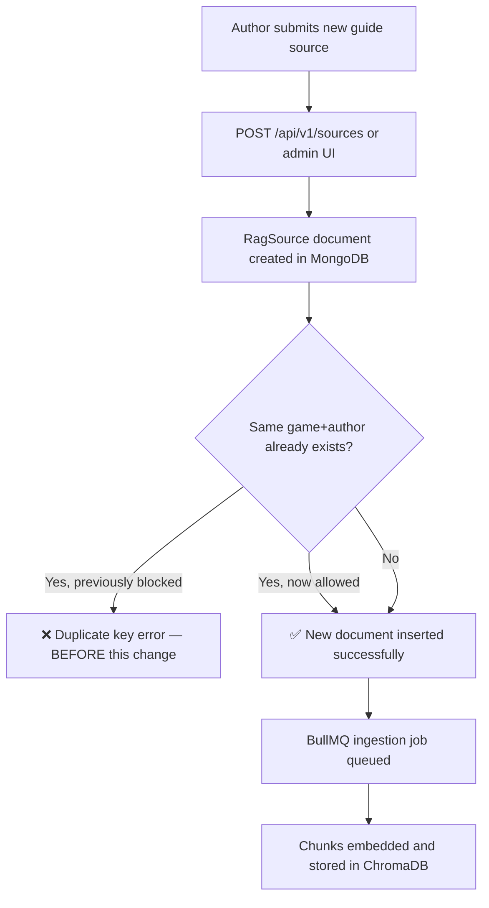

# Feature: Remove Unique-Per-Author Constraint on RagSource Game+Author Index

**Status:** Approved
**Owner:** rjasino-fs
**Last Updated:** 2026-05-30

---

## Goal

Allow an author to submit multiple RAG guide sources for the same game by removing the unique compound index on `{ metadata.game, metadata.author }` in the `RagSource` schema.

## Stakeholders

- **Requestor:** rjasino-fs
- **Users affected:** Content authors submitting guide sources via the ingestion pipeline
- **Teams involved:** Backend (packages/db, apps/workers, apps/inference)

---

## User Stories

### Story 1: Multiple Guides Per Author

**As a** content author,
**I want to** submit more than one guide for the same game,
**So that** I can provide separate, categorized sources (e.g. a main walkthrough and a secrets/collectibles guide) that the RAG pipeline can index independently.

#### Acceptance Criteria

- **Given** an author has an existing `RagSource` for Game A, **When** they submit a second source with the same `metadata.author` and `metadata.game`, **Then** the document is created successfully (no duplicate-key error).
- **Given** two sources share the same author and game, **When** both are ingested, **Then** both appear as separate documents in the `rag_sources` collection with distinct `_id` values.
- **Given** a source is queried by game, **When** the index is used, **Then** query performance is not regressed (non-unique index retained for game lookups).

---

## Data Requirements

| Field | Type | Required | Constraints | Notes |
| ----- | ---- | -------- | ----------- | ----- |
| `metadata.game` | `string` | No | No uniqueness constraint (was: unique per author) | Partial index still indexes only when field is a string |
| `metadata.author` | `string` | No | No uniqueness constraint (was: unique per game) | Same as above |

**Schema change:** The compound index `{ "metadata.game": 1, "metadata.author": 1 }` on `ragSourceSchema` changes from `unique: true` to a plain (non-unique) index. The `partialFilterExpression` is retained so the index only covers documents where both fields are present strings, preserving query efficiency without enforcing uniqueness.

---

## Flow Diagram

---

## API Contract (for @backend-dev)

N/A — No API surface changes. This is a schema-only change. Existing ingestion endpoints and workers are unaffected; the only behavioral change is that MongoDB no longer rejects a duplicate `game+author` pair.

---

## Edge Cases

- **Duplicate titles by same author for same game:** Now allowed at the DB level. If deduplication by title is desirable in the future, it should be a separate application-layer guard — not enforced here.
- **Existing unique index in MongoDB:** The live MongoDB collection still has the old unique index. Dropping and recreating it requires a migration step (drop the old index, create the new non-unique one). Mongoose will not auto-migrate a live index from unique to non-unique on startup.
- **No data loss risk:** Removing uniqueness never invalidates existing documents; it only relaxes the constraint on new inserts.
- **Workers and inference:** Neither `apps/workers` nor `apps/inference` relies on the uniqueness invariant — they process whatever `sourceId` they receive. No changes needed there.

---

## Out of Scope

- Application-layer deduplication by title or content hash — not part of this change.
- UI changes to the guide submission flow.
- Any new fields or status values on `IRagSource`.
- Multi-game or multi-author ingestion generalization.

---

## Open Questions

✅ Should the non-unique compound index `{ game, author }` be kept for query performance, or is a single-field index on `metadata.game` sufficient? — **Resolved:** Drop the index entirely for now; query optimization is deferred to a later task.
✅ Is a one-time migration script needed to drop the old unique index from the live MongoDB collection, or will the dev environment be reset? — **Resolved:** Yes, provide a one-time migration script to drop the old index from the live collection.

---

## Dependencies

- **Depends on:** None — `packages/db` is self-contained for this change.
- **Blocks:** Nothing currently blocked on this constraint.
