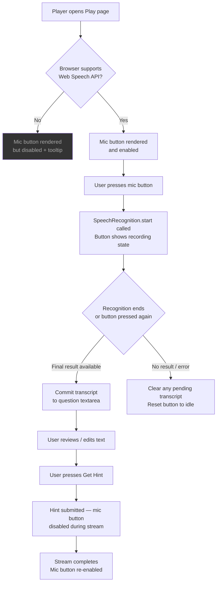

# Feature: STT Push-to-Talk Voice Input

**Status:** Approved
**Owner:** rjasino-fs
**Last Updated:** 2026-05-30

---

## Goal

Add a push-to-talk mic button to the Play page so players can dictate their hint question by voice rather than typing, reducing friction during active gameplay.

## Stakeholders

- **Requestor:** rjasino-fs
- **Users affected:** Players using the Play page on Chromium-based browsers
- **Teams involved:** Frontend only

---

## User Stories

### Story 1: Dictate a hint question by voice

**As a** player on the Play page,
**I want to** press a mic button and speak my question,
**So that** the question textarea is populated without me having to type mid-game.

#### Acceptance Criteria

- **Given** the browser supports Web Speech API, **When** the user presses the mic button, **Then** recording starts and the button changes to an active/recording state.
- **Given** recording is active, **When** the user presses the mic button again (or speech recognition ends naturally), **Then** recording stops and the final transcript is written into the question textarea.
- **Given** a transcript has been committed, **When** the user reviews it, **Then** they can edit the text before pressing "Get Hint" — no auto-submit occurs.
- **Given** a hint is currently streaming, **When** the user views the mic button, **Then** the button is disabled and non-interactive (same behaviour as the textarea).
- **Given** the browser does not support Web Speech API (non-Chromium), **When** the user hovers the mic button, **Then** a tooltip reads "Voice input requires a Chromium-based browser" and the button is not clickable.
- **Given** recording is active, **When** speech recognition returns only a final result (not interim), **Then** no partial text appears in the textarea until recording stops.

### Story 2: Graceful degradation on unsupported browsers

**As a** player on Firefox or Safari,
**I want to** see the mic button but understand why it's unavailable,
**So that** I'm not confused by a missing feature.

#### Acceptance Criteria

- **Given** the browser does not expose `SpeechRecognition` or `webkitSpeechRecognition`, **When** the Play page loads, **Then** the mic button is rendered but visually disabled (reduced opacity, `not-allowed` cursor).
- **Given** the disabled mic button, **When** the user hovers it, **Then** a native `title` tooltip explains the browser requirement.

---

## Data Requirements

| Field | Type | Required | Constraints | Notes |
| ----- | ---- | -------- | ----------- | ----- |
| `transcript` | `string` | No | Max length governed by browser STT | Ephemeral — committed to `question` state, never persisted |
| `listening` | `boolean` | No | — | Local React state only |
| `supported` | `boolean` | No | — | Derived from `typeof SpeechRecognition !== 'undefined'` at hook init |

No new database fields, API fields, or MongoDB documents are introduced by this feature.

---

## Flow Diagram

---

## API Contract

N/A — This feature is entirely client-side. No new Express endpoints, no Next.js Route Handler changes. The existing `/api/hint` endpoint is called as-is after the user presses "Get Hint".

---

## Edge Cases

- **Recognition error event** (`onerror`) — reset `listening` to `false`, leave the textarea unchanged, log the error code to console. Do not surface a modal; the user can simply try again.
- **No speech detected** — browser fires `end` without a result. Reset `listening` to `false`; textarea unchanged.
- **User navigates away while recording** — `useEffect` cleanup calls `recognition.abort()` to prevent dangling browser permissions.
- **Double-press race** — if the user presses the button while the recognition instance is still starting up, ignore the second press (guard with `listening` state).
- **Very long dictation** — browser STT has its own timeout; when it fires `end`, commit whatever final result was captured (may be empty).
- **Transcript overwrites existing text** — the final transcript replaces whatever is currently in the textarea (not appended). This matches the simplest mental model for a push-to-talk interaction.

---

## Out of Scope

- **"Hey SS" wake phrase** — deferred; will be a follow-on spec.
- **Interim / real-time transcript display** — only final results are committed.
- **Auto-submit on transcript commit** — user must press "Get Hint" manually.
- **Audio recording or persistence** — transcription only; raw audio is never captured or stored (aligns with the privacy rule in `.claude/rules/security.md`).
- **Mobile / PWA voice input** — not a target platform for MVP.
- **Multi-language STT** — English only; no `lang` UI exposed.

---

## Open Questions

✅ Mic button style: icon-only (mic icon), no text label.
✅ Overwrite behavior: silent overwrite — no undo affordance for MVP.

---

## Dependencies

- **Depends on:** `PlayClient.tsx` question textarea (already exists — no prerequisite work needed)
- **Blocks:** "Hey SS" wake phrase feature (deferred — will build on top of this hook)
